# ToPu Weight Editor

  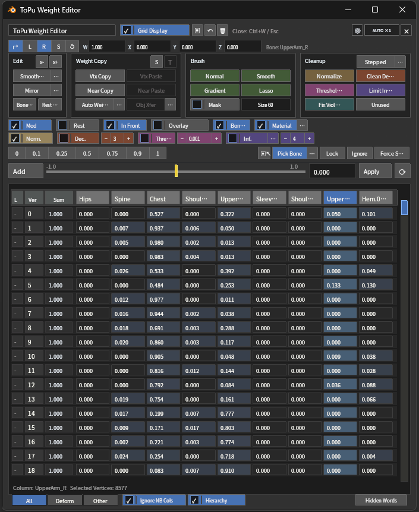

  <a href="README.md">日本語</a> | <b>English</b>

ToPu:Weight Editor is a Blender add-on for reviewing and editing skin weights.
From a **GPU overlay** drawn in the 3D View, it puts numeric editing, cleanup, smoothing, mirroring, copy / transfer, bone picking, bone creation and display helpers into one place. No external framework or extra Python package is required.

> **This document describes version 1.5.244.**
> The N-panel and Pie Menu from the 1.4 series have been removed; all operations now live in the GPU overlay. The overlay shortcut also changed from `W` to `Ctrl + W`.

## Table of contents

- [Features](#features)
- [Requirements](#requirements)
- [Installation](#installation)
- [Opening the editor](#opening-the-editor)
- [Quick start](#quick-start)
- [GPU overlay / Header row](#gpu-overlay--header-row)
- [Weight snapshots](#weight-snapshots)
- [Bone transform](#bone-transform)
- [Edit](#edit) ([Smooth Weights](#smooth-weights) / [Mirror](#mirror) / [Bone Creation](#bone-creation) / [Apply Rest Pose](#apply-rest-pose))
- [Weight Copy](#weight-copy) ([Auto Weight](#auto-weight) / [Object transfer](#object-transfer))
- [Brushes](#brushes)
- [Cleanup](#cleanup)
- [Display helpers](#display-helpers)
- [Edit Settings / Auto-cleanup reference values](#edit-settings--auto-cleanup-reference-values)
- [Presets, Input & Apply](#presets-input--apply)
- [Special Group Selection / Pick Bone](#special-group-selection--pick-bone)
- [Column State & Visibility](#column-state--visibility-lock--ignore--force-show)
- [Grid Controls & Bottom Tabs](#grid-controls--bottom-tabs)
- [Multi-object editing](#multi-object-editing)
- [Add-on preferences](#add-on-preferences)
- [Shortcuts](#shortcuts)
- [Changes made to the blend file](#changes-made-to-the-blend-file)
- [License and third-party attribution](#license-and-third-party-attribution)

## Features

  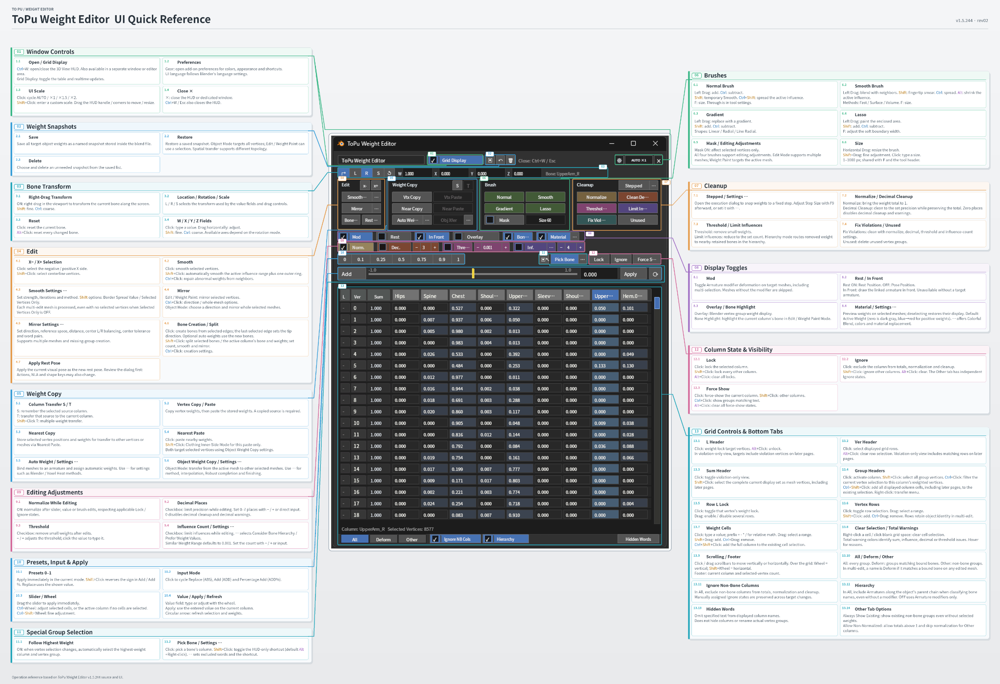

- Review and edit weights from the GPU overlay in both Edit Mode and Weight Paint Mode
- Save and restore named weight snapshots
- Pick bones, edit bone transforms, Smooth Weights, Mirror and Apply Rest Pose
- Create bones from selected edges, auto-weight with the generated bones, and split existing bones and weights
- Vertex copy / nearest transfer / object-to-object transfer / vertex-group transfer
- Two automatic weighting methods (Blender built-in / Voxel Heat Skinning)
- Four weight brushes (Normal / Smoothing / Gradient / Lasso)
- Cleanup commands (Normalize, Clean Decimals, Limit Influences, Threshold Cleanup, Fix Violations, Unused, Stepped)
- Display helpers such as bone highlighting and weight-color preview
- Intuitive numeric editing through cells, the slider and presets
- Simultaneous editing of several meshes, with vertex-group selection sync
- A dedicated ToPu Weight Editor area available as a Blender editor type, plus a separate dedicated window
- Japanese / English UI (follows Blender's language setting)

## Requirements

- **Blender 4.2 LTS or newer**
- No additional Python packages (NumPy is used when available, otherwise a scalar fallback)

> On some older CPU / GPU setups, performance can drop when the graphics backend is set to `Vulkan`. Switching to `OpenGL` may improve it.

## Installation

1. Download the distribution ZIP from `Assets` of the latest [release](https://github.com/http4211/ToPu_weight_editor/releases).
2. Drag & drop the ZIP onto the Blender window (or choose `Edit > Preferences > Add-ons > Install from Disk` and select the ZIP).
3. Enable `ToPu:Weight Editor` in the add-on list.

Two icon buttons are then added to the 3D View tool header.

## Opening the editor

  

  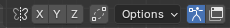

- **Tool-header buttons** — the armature icon shows / hides the GPU overlay; the window icon opens / closes the dedicated window.
- **Shortcut** — `Ctrl + W` toggles the overlay; `Ctrl + W` or `Esc` closes it.
- **Editor Type** — choose `ToPu Weight Editor` from the Editor Type selector at the upper-left of any area.

> The tool-header buttons can be hidden with `Show GPU Overlay Button in Tool Header` in the add-on preferences.

### Dedicated area / window

Choosing `ToPu Weight Editor` from the Editor Type selector turns that area into a dedicated weight-editing area. It is stored with its screen / workspace in the `.blend`, and its HUD is restored when the file is opened. The window icon in the tool header can open the same dedicated area in a separate window.

- Operations are the same as the 3D View version. `Clean View` hides the header, toolbar, sidebar and other chrome; click it again to restore.
- Only one HUD is interactive at a time. Another `ToPu Weight Editor` area shows `Make This the Main Area` to adopt the HUD.
- Blender and the OS manage the window size and placement; adjust the HUD size separately with the scale button.
- The viewport display toggles (`Modifier`, `Rest`, `In Front`, `Overlay`, and so on) target the 3D View that opened the dedicated window.

## Quick start

  

<a href="docs/images/shared/quick-start.mp4">Open video (MP4)</a>

1. Select a mesh that is bound to an armature.
2. Enter Edit Mode or Weight Paint Mode.
3. Select the vertices you want to edit.
4. Open the GPU overlay from the tool-header icon or with `Ctrl + W`.
5. Turn on `Grid Display`.
6. Click a column header to choose the vertex group.
7. Adjust weights with cells, the slider, the value field, presets or brushes.
8. Finish with `Normalize`, `Clean Decimals`, `Threshold Cleanup`, `Limit Influences` and `Fix Violations`.

## GPU overlay / Header row

- Drag the title field to move the overlay; drag any corner to resize it.
- `Grid Display` — toggles grid display and realtime update.
- `▣` `↶` `🗑` — save / restore / delete a [weight snapshot](#weight-snapshots).
- `⚙` — opens the add-on preferences.
- `AUTO ×1` — click to cycle `Auto` → `×1` → `×1.5` → `×2`. `Shift + Click` to enter `0.50`–`4.00`.
- `×` — closes the overlay.

> The HUD scale is stored separately for the 3D View and for the dedicated area / window. `Auto` follows Blender's UI scale and the available drawing area.

## Weight snapshots

`▣` `↶` `🗑` in the header row provide temporary weight storage and restoration.

- `▣` — save all weights of the target object under a name.
- `↶` — restore from the list. Object Mode restores the whole target. Edit / Weight Paint Mode can restore the whole target or selected vertices only (`Restore Selected Vertices Only` is off by default).
- `🗑` — delete a saved snapshot (single or bulk).

`Restore Method` offers `Auto`, `Vertex Index` and `Nearest Transfer`. `Auto` restores the same object with the same vertex count by vertex index; a different object or topology uses the saved positions and normals for spatial transfer (interpolation and so on follow the `Object Weight Copy` detail settings).

> Snapshots are compressed and stored inside the `.blend`. Large snapshots increase the file size.

## Bone transform

  

When the selected column matches a bone, its `Location`, `Rotation` and `Scale` can be reviewed and edited. Useful for nudging the pose while watching how the weights behave.

- `L` `R` `S` — edit Location / Rotation / Scale. Click a value field to type directly, or horizontal-drag to change (`Shift` for fine steps, `Ctrl` for large steps).
- `↱` — toggles right-drag editing in the viewport. While on, right-dragging changes the current value along the screen direction.
- `↺` — restore the current bone to its original values. `Alt + ↺` restores every changed bone.

## Edit

  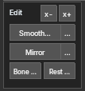

The `Edit` section holds `x-` / `x+`, plus `Smooth Weights`, `Mirror`, `Bone Creation` and `Apply Rest Pose`.

### Selecting vertices by X side

  

Selects vertices on the `x-` or `x+` side, using the armature origin (or each object's origin when there is no armature) as the reference.

- Plain click — does not select vertices on the center line.
- `Shift + Click` — selects only the center-line vertices.

### Smooth Weights

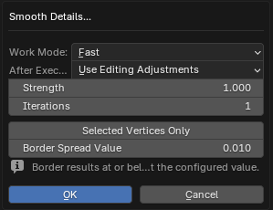

  

Blends the weights of the selected vertices into their surroundings.

- Plain click — smooths the selected vertices.
- `Shift + Click` — smooths the selected column’s weighted region plus one outer ring. In multi-object Edit Mode, this includes meshes with no selected vertices.
- `Ctrl + Click` — repairs abnormal weights using the surroundings as the reference.
- `…` — detail settings: range, method (`Fast` / `Surface` / `Volume`), iterations, and the cleanup applied afterwards.
- Shift-click settings: `Border Spread Value` (default `0.01`; `0` disables outward expansion) and `Selected Vertices Only` (off by default). Enable the latter to restrict the whole range, including the outer ring, to selected vertices.

### Mirror

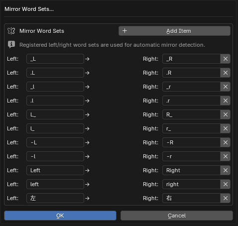

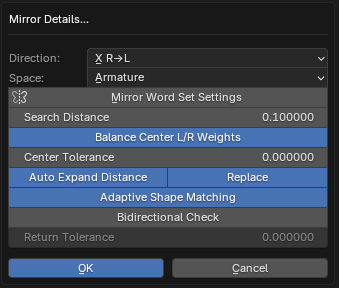

  

Brings weights over from the mirrored position on the opposite side. Left/right names such as `_L` / `_R` are swapped as well.

- Plain click — mirrors selected vertices in Edit / Weight Paint Mode. In Object Mode, opens a direction dialog and mirrors the whole selected meshes.
- `Ctrl + Click` — choose a direction and mirror the whole target object (or selected vertices only).
- `…` — detail settings: mirror direction, reference space, search distance, center correction, center tolerance and the left/right word sets.

Notes.

- Supports multiple meshes. Selected-vertex mirroring uses each mesh’s own selection; whole-mesh mirroring also includes edited meshes with no selected vertices.
- Asymmetric geometry is supported (the reflected position is projected onto the source surface and interpolated; can be disabled in the details).
- If the opposite vertex group is missing but the corresponding opposite bone exists, it is created automatically (otherwise a dialog lets you create or skip).
- **Center L/R Balancing** (on by default) balances the L/R weights of center-axis vertices. Turn off `Balance Center L/R Weights` in Mirror Details to skip only this step.

### Bone Creation

  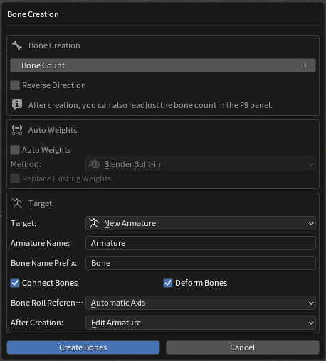
  

Creates a bone chain or branched bone tree from edges selected in Mesh Edit Mode.

- Plain click — chooses a suitable method from the selected edges and opens the confirmation dialog (closed loops / open paths / edge rings / branching edges).
- `Ctrl + Click` — opens `Bone Creation Settings` (defaults).
- Bone direction is based on the last-selected active edge, which becomes the tip.
- `Bone Count` and `Reverse Direction` (and `Branch Count` for branches) can be adjusted in the confirmation dialog and via `F9`. The dialog also controls Auto Weights, target, naming, connection, roll reference and post-creation mode.
- Multiple open paths — `Center Axis` off creates an independent chain on each path; on averages them into one center chain.

`Auto Weights` (in the dialog) weights the target region using only the newly created bones (`Blender Built-in` / `Voxel Heat Skinning`). With `Replace Existing Weights`, existing bone weights belonging to the destination armature are cleared from the target vertices first. Unrelated vertex groups are preserved.

> The target is normally the selected vertices. When multiple open edge paths enclose the same connected mesh strip, unselected vertices between them are included. Disconnected meshes are unaffected. `Center Axis` uses the same region.

`Bone Roll Reference` aligns the bone axes while keeping each bone along its chain.

- `Automatic Axis` — chooses a suitable reference axis automatically.
- `Selected Edge Surface` — follows the faces connected to the selected edges.
- `Mesh Local Z` — uses the mesh’s local Z axis.
- `Mesh Local Y` — uses the mesh’s local Y axis.
- `World Z` — uses the world Z axis.
- `World Y` — uses the world Y axis.

#### Split Bone and Weights

  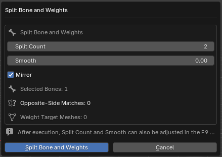

`Shift + Click` on `Bone Creation` splits existing bones into connected chains and redistributes each matching vertex-group weight among the resulting bones.

- Target — the selected bones (Pose / Object / Armature Edit Mode), or the bone matching the TPWE active column (Mesh Edit Mode).
- `Split Count` (2–64) and `Smooth` (transition width between split bones, default `0`).
- `Mirror` (on by default) — splits the opposite side with the same settings using the left/right word sets.
- After execution, `F9` can readjust `Split Count`, `Smooth` and `Mirror`.

### Apply Rest Pose

  

Applies the current visual pose as the new rest pose. Action and shape-key retargeting are supported.

> It can modify armature rest data, mesh / shape-key coordinates, Actions and NLA-referenced animation. **Save a backup before running it.**

## Weight Copy

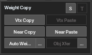

  

- `Vtx Copy` / `Vtx Paste` — copy the active vertex's weights and paste onto the selected vertices.
- `Near Copy` — stores the selected vertices’ positions and weights.
- `Near Paste` — pastes weights onto selected vertices using the stored positions. `Shift + Click` enables `Clothing Inner-Side Mode` for that paste only.
- Both paste actions target selected vertices and share the `Object Weight Copy` settings. Shift-click does not change the saved settings.
- `Auto Weight` — bind the selected meshes to an armature and assign automatic weights.
- `Obj Xfer` — transfer weights from the active mesh to the other selected meshes.

The `…` next to `Auto Weight` and `Obj Xfer` opens their detail settings.

### S / T buttons (column transfer)

`S` / `T` on the right of the section title are transfer shortcuts for the current column.

- `S` — register the current column as the transfer source.
- `T` — transfer from the registered source into the current column.
- `Shift + T` — open the `Multi Weight Transfer` dialog, pre-filled with the source and current column.

### Object transfer

Transfers weights from the object selected last (the active one) to the other selected objects. Because it transfers per face, results stay relatively clean even on low-poly meshes (at the cost of a heavier computation).

- `Robust Weight Inpainting` — fills in unmatched areas during the transfer.
- `Clothing Inner-Side Mode` — uses source normals and distance to prioritize inner-shell candidates.
- If a destination has no Armature modifier, one can be added automatically (on by default).

### Auto Weight

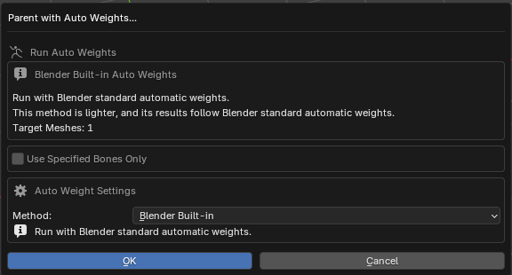

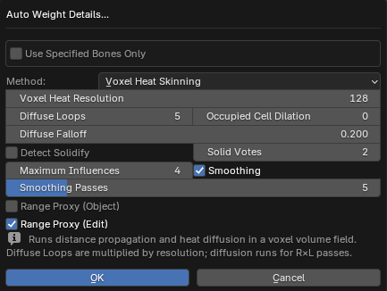

Binds the selected meshes to an armature and assigns automatic weights. In Object Mode, it can preserve parent-child relationships among selected meshes (on by default). It can also weight only the part covered by the current selection. The detail settings switch between Blender's built-in automatic weights and Voxel Heat Skinning.

**Main Voxel Heat Skinning settings**

- `Voxel Heat Resolution` — voxels along the longest axis. Higher preserves more detail but increases time and memory.
- `Diffuse Loops` — diffusion passes (resolution × loops). Higher propagates more smoothly but takes longer.
- `Occupied Cell Dilation` — expands surface voxels to prevent broken propagation on thin outfits. Set `0` if weights leak across touching parts.
- `Diffuse Falloff` — higher reduces distant-bone contribution, producing tighter local weights.
- `Distance Falloff` — higher favors nearby bones more strongly.
- `Detect Solidify` — gives thin outfits and shells volume (occupied-cell dilation is at least 1 when on).
- `Solid Votes` — axis-inside tests required to classify an interior cell. `2` majority, `1` broader, `3` stricter.
- `Maximum Influences` — max bones per vertex (default `4`).
- `Smoothing` / `Smoothing Passes` — smooths boundaries after weighting (default ON, `5` passes).
- `Range Proxy (Object)` — uses visible meshes only to correct the calculation range. Weights are written only to selected meshes (default OFF).
- `Range Proxy (Edit)` — for partial weighting, uses unselected vertices and meshes sharing the armature as proxies. Weights are written only to selected vertices (default OFF).

> Processing time depends heavily on resolution, `Diffuse Loops` and target vertex count, and Blender may remain unavailable until it finishes.

**Use Specified Bones Only**

When on, automatic weighting is restricted to the saved bone list (both methods, Object and Edit Mode).

- `Get Selected Bones` — captures the bone selection from Edit / Pose / Object Mode.
- `All` / `None` and the checklist adjust the list.
- `Enabled First` (on by default) — groups enabled bones at the top.

## Brushes

  

The overlay can start the add-on's own weight brushes, used directly in the viewport. They work in both Edit Mode and Weight Paint Mode, and bone picking / bone transform stay available while brushing.

- `F` changes the size; `Tab` / `Q` / `Esc` return to the previous tool.
- The tool header exposes size, selection mask and each brush’s value.
- HUD `Size`: drag horizontally to change, `Shift + Drag` for fine adjustment, or click to type. The range is `1–1000 px`, shared with `F` and the tool header.
- Edit Mode supports multiple meshes; Weight Paint targets the active mesh.
- All four brushes support the editing settings for normalization, decimals, threshold and influence count.

### Normal brush

  

The basic brush that adds to or subtracts from the selected column.

- Left-drag adds; `Ctrl + Left-drag` subtracts.
- `Shift + Left-drag` temporarily smooths; `Ctrl + Shift + Left-drag` spreads surrounding influences.
- `Normal Amount` — how much one stroke changes.
- `Constant Paint` — avoids over-layering when the same vertex is hit repeatedly.
- `Stack Paint` — adds/subtracts `Normal Amount` on every touch, building up gradually.
- `Through` in the tool settings — also paints layered surfaces behind the frontmost surface.

### Smoothing brush

  

Blends weights with the surrounding vertices. By default, it processes editable groups together to soften paint edges and seams left after mirroring.

- Left-drag smooths the weights around the cursor.
- `Shift + Left-drag` — moves weights like a fingertip.
- `Ctrl + Left-drag` — spreads the selected column’s stronger weights outward.
- `Alt + Left-drag` — blends toward weaker nearby values to shrink the selected column’s influence.
- `Active Group Only` — smooths only the active group, allowing its weights to spread to zero-weight vertices when neighbors have weight in the same group.
- `Strength` — how far values move toward their neighbours; `Iterations` — how many passes run.
- When an ignored column is selected, only that ignored column is processed.

`Work Mode` switches the behavior.

- `Fast` — processes only the connected edges under the cursor (lightest).
- `Surface` — walks connected topology (does not bleed to the back side).
- `Volume` — also references spatially-near vertices to match local density (`Volume Range` tunes the reach).

### Gradient brush

  

Builds a weight gradient along the drag direction.

- Plain left-drag replaces weights with the gradient.
- `Gradient Value` — the maximum weight (the falloff curve runs from this value down to 0).
- Hold `Ctrl` for the subtract direction, `Shift` for the add direction.
- Type — `Linear` (straight) / `Radial` (outward from the start point) / `Line Radial` (spreads from the dragged line).
- `Falloff` — `Linear` / `Smooth` / `Sphere` / `Root` / `Sharp`, or `Custom` (`Custom Exponent` `0.1`–`8`).

### Lasso brush

  

Fills an enclosed area with a set value. Good for flattening a wide area to 0 / 0.5 / 1.0 in one action.

- Left-drag to enclose an area; `Lasso Value` is applied inside it.
- Hold `Ctrl` for the subtract direction, `Shift` for the add direction.
- The brush size is used as the width that blends the boundary.

### Selection mask

  

Turning `Mask` on restricts the brush to the currently selected vertices. Helps avoid painting nearby parts or back-side vertices by accident. Shared by all brushes. If no vertices are selected, painting does not run.

## Cleanup

  

- `Normalize` — normalizes the weight total of the selected vertices to 1.0.
- `Clean Decimals` — rounds weight values to the configured digits (disabled at `0`).
- `Threshold Cleanup` — zeroes weights at or below the threshold.
- `Limit Influences` — brings each vertex within the maximum influence count.
- `Fix Violations` — applies normalize, decimals, threshold and influence-count settings together.
- `Unused` — deletes unused vertex groups.
- `Stepped` — opens an execution dialog in the 3D View and snaps weights to a fixed step while keeping each vertex total. Use `F9` afterwards to adjust Step Size; `…` also sets the step size.

> Reference values come from [Edit Settings / Auto-cleanup reference values](#edit-settings--auto-cleanup-reference-values). Run in Object Mode, these act on every vertex of the object. Editable center-axis L/R pairs that were already equal stay equal.

## Display helpers

  

- `Mod` — toggles Armature modifier display (pose deformation) across the current targets, including multi-edit and Object Mode multi-selection. Meshes without an Armature modifier are skipped.
- `Rest` — on for Rest Position, off for Pose Position. `Rest` and `In Front` are unavailable without a target armature.
- `In Front` — toggles In Front display for the armatures.
- `Overlay` — toggles Blender's Vertex Group Weights display.
- `Bone Hi` — highlights the bone matching the active vertex group (or the selected column), in Edit / Weight Paint Mode only. Its enabled state is restored on reload.
- `Material` — toggles the weight-color preview. The `…` next to it configures color (hue / saturation / value) and material replacement.

### Weight-color preview

`Material` previews weights on selected meshes. Deselected meshes return to their original display.

- `Active Weight` (default) — shows the active group from blue to red, with zero weights in dark gray.
- `Colorful Blend` — combines colors from multiple groups.
- Use the adjacent `…` to choose the mode, colors and material replacement.

- Creates a uniquely named, add-on-owned color attribute (it never overwrites or deletes a same-named user attribute).
- `Replace Materials` (off by default) — only when on does it temporarily replace material slots, restoring them when the preview is disabled. Skipped on shared mesh data.

> Preview performance depends on mesh size and the number of selected meshes.

## Edit Settings / Auto-cleanup reference values

  

`Normalize`, `Decimals`, `Threshold` and `Influence Count` set the reference values used by the [Cleanup](#cleanup) buttons.

- Checked items are applied automatically whenever the add-on changes a value.
- Use the `−` / `+` buttons, or type into the value field, to change a value.
- `Decimal Places` ranges from `0–7`. `0` disables decimal cleanup and decimal violations; normalization, threshold and influence-count checks remain active.
- The `…` on `Influence Count` opens `Influence Cleanup Settings`.

**Influence Cleanup Settings** (which bones to keep when a vertex exceeds the influence limit)

- `Consider Bone Hierarchy` (default) — keeps influences spread across the separate chains that branch off a shared parent bone (for example the left and right legs splitting from the hip), so a vertex driven by several chains (a skirt influenced by both legs) is less likely to lose one whole chain.
- `Prefer Weight Values` — the ordinary approach: keeps the highest-weighted bones first.
- `Similar Weight Range` (default `0.001`) — the weight difference within which hierarchy can change the retention order. Groups without a hierarchy use `Prefer Weight Values`.
- Removed weight goes to the nearest retained bone in the hierarchy; a retained parent wins an equal-distance tie.

> Automatic cleanup is not guaranteed to catch everything, so running `Fix Violations` as a final check is recommended.

## Presets, Input & Apply

### Preset buttons

  

Applies `0`, `0.1`, `0.25`, `0.5`, `0.75`, `0.9` or `1` in one click. In `Add` / `Add%` mode, `Shift + Click` applies the negative value. Preset values can be changed in the add-on preferences.

### Input mode, slider and value field

  

The leftmost button cycles the input mode through `ABS` → `ADD` → `ADD%`.

- `Abs` — replaces the value with the entered one.
- `Add` — adds to the current value (negative values subtract).
- `Add%` — adds a percentage of the current value.

Usage.

- Dragging the slider applies in real time (with **10,000+ target vertices**, weights are committed on release).
- Click the value field to type; scroll the wheel over it to nudge the value.
- `Apply` — applies the value field to the current column of the selected vertices.
- `⟳` — rebuilds the grid from the current selection (useful after special selection commands).
- `Ctrl + Wheel` adjusts weights; `Ctrl + Shift + Wheel` uses finer steps. Selected cells take priority; otherwise the current column is used. Step sizes are set in preferences.

## Special Group Selection / Pick Bone

  

`Pick Bone` lets you click a bone in the viewport to select the vertex-group column with that bone's name. With several Armature modifiers, the globally nearest visible bone is used.

- While the overlay is open, `Alt + Right Click` also starts bone picking by default (`Shift + Click` on `Pick Bone` toggles it).
- The `…` opens the excluded-word and shortcut settings (excluded words keep bones containing `IK`, `FK`, `twist` and similar out of the candidates).
- When `▣↖` is on, changing the selection automatically selects the highest-weight column. Suits switching vertices often to check the dominant influence bone.

## Column State & Visibility (Lock / Ignore / Force Show)

  

- `Lock` — makes the selected column non-editable.
- `Ignore` — excludes the column from totals, normalization and cleanup.
- `Force Show` — keeps a column in the grid even when its weights are zero.
- `Shift + Click` applies to every column except the selected one; `Alt + Click` clears the state everywhere.
- `Ctrl + Force Show` opens a text filter to force-show every group matching comma-separated fragments.

## Grid Controls & Bottom Tabs

### Column headers

  

- Click — makes it the selected column.
- `Shift + Click` — selects every vertex that has a value in that group.
- `Ctrl + Click` — keeps only the current-selection vertices that have a value in that column.
- `Ctrl + Shift + Click` — adds every cell in that column to the existing cell selection, including displayed rows on later pages.
- Right-click — opens the [weight transfer menu](#column-right-click-weight-transfer).

### L / Ver / Sum

  

- `L` — weight-lock the target vertices (`Alt + Click` unlocks). Each row's `L` cell also toggles the lock (drag for several).
- `Ver` — grid-select the displayed rows (`Alt + Click` clears). Click a vertex number to toggle its row selection, drag to select a range, `Shift + Click` to add, or `Ctrl + Drag` to remove.
- `Sum` — toggle **violation-only view** (`Shift + Click` selects the vertices shown in the grid).
- When some vertices have a total-value or influence-count problem, the `Sum` header changes to `Sum ⚠`.
- Violation-only view covers every page. In this view, `L` / `Ver` header actions also include matching rows on later pages. `Shift + Click` on `Sum` selects the entire current display set as mesh vertices.
- Total-cell warning colors identify sum, influence-count, decimal or threshold problems. Hover to see the reasons.

### Cells

  

- Click — type the value directly (`Enter` confirms). Start with `+` `-` `*` `/` for a relative operation (for example `*0.5` or `+0.1`).
- Drag — select a range (`Shift + Drag` adds, `Ctrl + Drag` removes).
- Right-click, or click empty grid space — clear the cell selection.
- `Ctrl + Shift + Click` — adds the cell’s whole column to the existing selection, including displayed rows on later pages (also available from the column header).
- With several cells selected, the entered value applies to all at once. While a cell selection remains, every value-changing operation (slider / wheel / presets / Apply) prioritizes the selected cells over the live mesh selection.

### Column tabs

  
  

The tabs below the grid choose which columns are shown.

- `All` — bone columns and non-bone columns.
- `Deform` — only deform vertex groups whose names match a bone.
- `Other` — only non-bone vertex groups that do not match a bone name.

Use the scrollbars to move vertically or horizontally. Over the grid, the wheel scrolls vertically and `Shift + Wheel` scrolls horizontally. The footer shows the current column and selected-vertex count.

Per-tab options.

- `Ignore Non-Bone Columns` (All tab) — excludes non-bone columns from totals, normalization and cleanup. Manual Ignore choices survive target changes.
- `Hierarchy` (All tab, on by default) — includes armatures along the object’s parent chain when classifying bone columns. When off, only Armature modifiers are used.
- `Always Show` (Other tab) — always shows existing non-bone columns even when the selection has no values for them.
- `Allow >1` (Other tab) — when on, Other columns are not treated as violations at a total of 1 or more, and are not normalized.
- `Hidden Words` — removes only the specified text from displayed column names. It does not hide columns or rename actual vertex groups.

In multi-edit, a shared name is a bone column if any edited mesh’s applicable armature contains that bone. The `Other` tab has its own independent Ignore state.

### Column right-click weight transfer

  
  

Right-clicking a column header opens the vertex-group transfer menu.

- `Set as Transfer Source` / `Transfer to This Column` — make the right-clicked column the source and transfer into the current column.
- `Multi Weight Transfer` — transfer with explicit source, destination, method (`Copy` / `Move` / `Replace`) and scope (whole group / selected vertices). Several pairs can be processed together.

## Multi-object editing

When several meshes are in Edit Mode at once, the grid footer shows the current column, selected-vertex count and a multi-edit indicator (`N obj`), and the vertices of all objects are handled together.

A `Sync Selection` button is also added to `Properties > Object Data > Vertex Groups`; turning it on synchronizes the vertex-group selection across the objects.

## Add-on preferences

Open them with the `⚙` button in the overlay, or from `Edit > Preferences > Add-ons`.

- UI language follows Blender's `Preferences > Interface > Translation` settings.
- `Display Settings` — whether the GPU overlay button is shown in the tool header.
- `GPU Overlay UI Scale` — separate scales for the `3D View HUD` and the `Dedicated Area / Window HUD`.
- `GPU Overlay UI Style` — `Slightly Round UI Corners`.
- `GPU Overlay Color Theme` — built-in palettes (20) and user sets; import / export of presets.
- `GPU Overlay Preset Values` — changes the preset button values.
- `Scroll Step` — step sizes for `Ctrl + Wheel` and `Ctrl + Shift + Wheel`.
- `Default Influence Cleanup Method` — `Consider Bone Hierarchy` (default) or `Prefer Weight Values`.
- Left/right word sets — word pairs used to infer left/right names during mirroring.
- `Additional Shortcuts` — Smooth Weights and Pick Influence are off by default; HUD-only bone picking is on.
- `Shortcut Settings` — review and change the registered keymap.
- `Bulk Weight and Mirror Debug` — prints timing and mirror source/destination details to the console.

> `Auto` scale can be turned off to enter a manual value from `0.50` to `4.00`, kept in sync with the HUD scale buttons.

  
  

## Shortcuts

| Action | Default | Initial state |
| --- | --- | --- |
| Show / hide the GPU overlay | `Ctrl + W` | Enabled |
| Close the GPU overlay | `Ctrl + W` / `Esc` | Enabled |
| Add / subtract weights in selected cells or the current column | `Ctrl + Wheel` | Enabled |
| Fine weight adjustment in selected cells or the current column | `Ctrl + Shift + Wheel` | Enabled |
| Add a whole column to the cell selection | `Ctrl + Shift + Click` (header / cell) | Enabled |
| Pick a bone while the overlay is open | `Alt + Right Click` | Enabled |
| Smooth Weights | `Ctrl + Alt + S` | Disabled |
| Pick an influence from a bone | `Ctrl + Alt + B` | Disabled |

> Shortcuts can be reviewed and changed in the add-on preferences (except the bone-transform right-drag).

## Changes made to the blend file

The add-on does not access the network, run external programs, or install Python packages. It reads or writes an external file only when you choose `Import Color Preset` or `Export Color Preset`.

Some features intentionally modify the current blend file.

- **Dedicated area / window** — stores the marker and editor type in Screen / Workspace data (no OS window position).
- **Weight snapshots** — compressed and stored in Text datablocks (large ones increase file size).
- **Bone transform** — creates undo data as Text datablocks; obsolete anchors are removed automatically.
- **Bone Creation / Split Bone and Weights** — add bones to an armature and redistribute vertex-group weights.
- **Weight-color preview** — creates an add-on-owned color attribute (materials are only replaced when `Replace Materials` is on).
- **Apply Rest Pose** — may modify rest data, coordinates, Actions and NLA-referenced animation. Back up before applying.
- **Auto Weight** — creates temporary data during calculation and removes it when finished.
- **Object transfer** — can add an Armature modifier to a destination that has none (on by default).

> Bug reports and reproducible test files can be submitted to the [issue tracker](https://github.com/http4211/ToPu_weight_editor/issues).

## License and third-party attribution

The add-on itself is licensed under GPL-3.0-or-later.

- **Robust Weight Inpainting** — based on [RobustSkinWeightsTransferCode](https://github.com/rin-23/RobustSkinWeightsTransferCode) by Rinat Abdrashitov (MIT License), adapted for Blender. It does not bundle or require libigl or Polyscope. The original notice is in `LICENSES/RobustSkinWeightsTransferCode-MIT.txt`.
- **GPU overlay color palettes** — twenty built-in palettes were adapted from user-provided Blender theme extensions. `Blender Dark` / `Blender Light` are based on Blender's standard theme settings. Details are recorded in `LICENSES/BlenderThemePalette-Attributions.txt`.
