# ToPu Weight Editor

  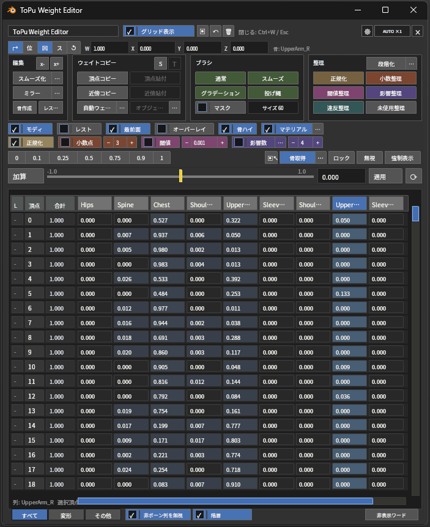

  <b>日本語</b> | <a href="README.en.md">English</a>

ToPu:Weight Editorは、Blender 上でスキンウェイトを確認・編集するアドオンです。
3D ビューに描画される **GPU オーバーレイ** から、数値編集・整理・スムーズ・ミラー・コピー / 転送・骨取得・骨作成・表示補助までをまとめて操作できます。外部フレームワークや追加の Python パッケージは不要です。

> **バージョン 1.5.244 時点の仕様です。**
> 1.4 系までの N パネルとパイメニューは廃止され、操作は GPU オーバーレイに一本化されました。表示ショートカットも `W` から `Ctrl + W` に変更されています。

## 目次

- [できること](#できること)
- [動作環境](#動作環境)
- [インストール](#インストール)
- [起動方法](#起動方法)
- [クイックスタート](#クイックスタート)
- [GPU オーバーレイ / ヘッダー行](#gpu-オーバーレイ--ヘッダー行)
- [ウェイトスナップショット](#ウェイトスナップショット)
- [骨トランスフォーム](#骨トランスフォーム)
- [編集](#編集)（[スムーズ化](#スムーズ化) / [ミラー実行](#ミラー実行) / [骨作成](#骨作成) / [レストポーズ適用](#レストポーズ適用)）
- [ウェイトコピー](#ウェイトコピー)（[自動ウェイト](#自動ウェイト) / [オブジェクト転送](#オブジェクト転送)）
- [ブラシ](#ブラシ)
- [整理](#整理)
- [表示補助](#表示補助)
- [編集設定 / 自動整理の基準値](#編集設定--自動整理の基準値)
- [値プリセット / 入力 / 適用](#値プリセット--入力--適用)
- [特殊グループ選択 / 骨取得](#特殊グループ選択--骨取得)
- [列状態 / 表示条件](#列状態--表示条件ロック--無視--強制表示)
- [グリッド操作 / 下部タブ](#グリッド操作--下部タブ)
- [複数オブジェクト編集](#複数オブジェクト編集)
- [アドオンプリファレンス](#アドオンプリファレンス)
- [ショートカット](#ショートカット)
- [blend ファイルへの変更について](#blend-ファイルへの変更について)
- [ライセンス / サードパーティ表記](#ライセンス--サードパーティ表記)

## できること

  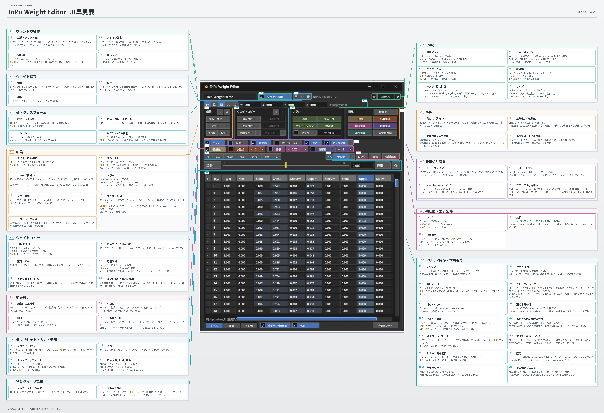

- 編集モード / ウェイトペイントモードの両方で、GPU オーバーレイからウェイトを確認・編集
- ウェイトスナップショットの保存・復元
- 骨取得・骨トランスフォーム編集・スムーズ・ミラー・レストポーズ適用
- 選択辺からの骨作成、生成骨による自動ウェイト、既存の骨・ウェイトの分割
- 頂点コピー / 近接転送 / オブジェクト間転送 / 頂点グループ間転送
- 2 種類の自動ウェイト（Blender 標準方式 / Voxel Heat Skinning）
- 4 種類のウェイトブラシ（通常 / スムーズ / グラデーション / 投げ縄）
- 整理コマンド（正規化・小数整理・影響整理・閾値整理・違反整理・未使用整理・段階化）
- ボーンハイライト・ウェイトカラープレビューなどの表示補助
- セル / スライダー / プリセットによる直感的な数値編集
- 複数メッシュの同時編集と頂点グループ選択の同期
- Blender のエディタータイプとして使える専用エリアと、独立した専用ウィンドウ
- 日本語 / 英語 UI（Blender の言語設定に追従）

## 動作環境

- **Blender 4.2 LTS 以降**
- 追加の Python パッケージは不要（NumPy があれば利用し、無ければスカラー処理へフォールバック）

> ※ 一部の古い CPU / GPU 環境では、グラフィックス API が `Vulkan` のときにパフォーマンスが低下することがあります。その場合は `OpenGL` に変更すると改善する場合があります。

## インストール

1. [リリースページ](https://github.com/http4211/ToPu_weight_editor/releases)の最新版 `Assets` から配布 ZIP をダウンロード。
2. ZIP を Blender のウィンドウへドラッグ&ドロップ（または `編集 > プリファレンス > アドオン > ディスクからインストール` で ZIP を選択）。
3. アドオン一覧で `ToPu:Weight Editor` を有効化。

有効化すると、3D ビューのツールヘッダーに 2 つのアイコンボタンが追加されます。

## 起動方法

  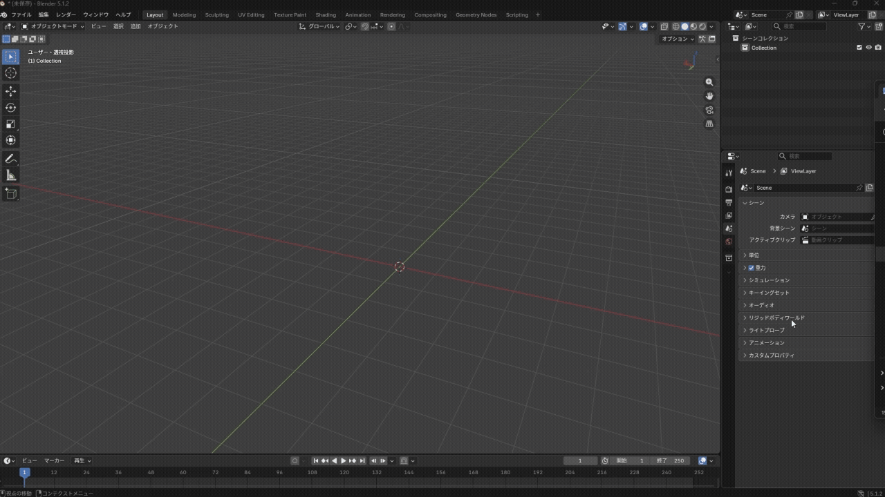

  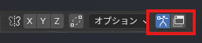

- **ツールヘッダーのボタン** : アーマチュアアイコンで GPU オーバーレイを表示 / 非表示、ウィンドウアイコンで専用ウィンドウを開く / 閉じる。
- **ショートカット** : `Ctrl + W` で表示 / 非表示。閉じるときは `Ctrl + W` または `Esc`。
- **エディタータイプの切り替え** : 任意のエリア左上のエディタータイプから `ToPu Weight Editor` を選ぶ。

> ※ ツールヘッダーのボタンは、アドオンプリファレンスの `ツールヘッダーにGPUオーバーレイボタンを表示` で非表示にできます。

### 専用エリア / 専用ウィンドウ

エディタータイプから `ToPu Weight Editor` を選ぶと、そのエリアをウェイト編集専用にできます。専用エリアはスクリーン / ワークスペースとともに `.blend` に保存され、ファイルを開くと HUD が復元されます。ツールヘッダーのウィンドウアイコンからは、同じ専用エリアを別ウィンドウとして開けます。

- 操作内容は 3D ビュー版と共通。`表示整理` でヘッダー・ツールバー・サイドバーなどをまとめて隠し、もう一度押すと元に戻します。
- 同時に操作できる HUD は 1 つ。別の専用エリアには `こちらをメインにする` が表示され、メインを切り替えられます。
- ウィンドウのサイズ・配置は Blender と OS が管理。HUD の大きさは倍率ボタンで個別に調整します。
- ビューポート表示の切り替え（`モディ` `レスト` `最前面` `オーバーレイ` など）は、専用ウィンドウを開いた元の 3D ビューに働きます。

## クイックスタート

  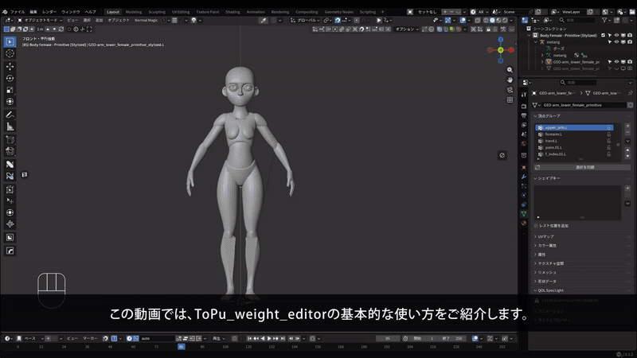

<a href="docs/images/shared/quick-start.mp4">動画を開く（MP4）</a>

1. アーマチュアにバインドされたメッシュを選択します。
2. 編集モード、またはウェイトペイントモードにします。
3. 編集したい頂点を選択します。
4. ツールヘッダーのアイコンまたは `Ctrl + W` で GPU オーバーレイを表示します。
5. `グリッド表示` を ON にします。
6. 列ヘッダーをクリックして頂点グループを選択します。
7. セル / スライダー / 数値欄 / プリセット / ブラシでウェイトを調整します。
8. 最後に `正規化` `小数整理` `閾値整理` `影響整理` `違反整理` で整えます。

## GPU オーバーレイ / ヘッダー行

  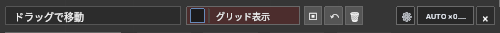

- タイトル欄をドラッグして位置を移動し、四隅をドラッグして大きさを変更します。
- `グリッド表示` : グリッド表示とリアルタイム更新を切り替えます。
- `▣` `↶` `🗑` : [ウェイトスナップショット](#ウェイトスナップショット)の保存 / 復元 / 削除。
- `⚙` : アドオンプリファレンスを開きます。
- `AUTO ×1` : クリックで `自動` → `×1` → `×1.5` → `×2`。`Shift + クリック` で `0.50〜4.00` を入力。
- `×` : オーバーレイを閉じます。

> ※ HUD 倍率は 3D ビュー用と専用エリア / ウィンドウ用で別々に保存されます。`自動` は Blender の UI 倍率と描画領域に合わせて調整されます。

## ウェイトスナップショット

  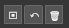

ヘッダー行の `▣` `↶` `🗑` で、ウェイトを一時保存・復元できます。

- `▣` : 対象オブジェクトの全ウェイトに名前を付けて保存。
- `↶` : 一覧から復元。オブジェクトモードでは対象全体、編集 / ウェイトペイントモードでは全体または選択頂点だけに復元できます（選択頂点のみは初期設定 OFF）。
- `🗑` : 一覧から選んで削除（個別 / 一括）。

`復元方式` は `自動` / `頂点番号` / `近接転送` から選べます。`自動` は、保存元と同じオブジェクトで頂点数も同じなら頂点番号で復元し、別オブジェクトや異なるトポロジーへは位置・法線で空間転送します（補間などは `オブジェクト転送` の詳細設定に従います）。

> ※ スナップショットは圧縮して `.blend` 内に保存されます。大きなスナップショットはファイルサイズを増やします。

## 骨トランスフォーム

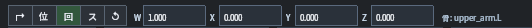

  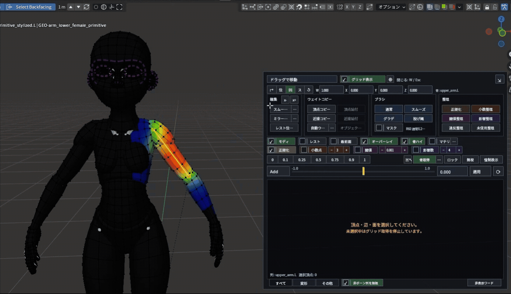

選択列に対応する骨があれば、その `位置` `回転` `スケール` を確認・編集できます。ポーズを少し動かしてウェイトの効き方を確認したいときに使います。

- `位` `回` `ス` : Location / Rotation / Scale を編集。数値欄はクリックで直接入力、横ドラッグで変更（`Shift` で微調整、`Ctrl` で大きく変更）。
- `↱` : ビューポート上の右ドラッグ編集を ON / OFF。ON のとき右ドラッグで、選択中の値を画面方向に合わせて変更できます。
- `↺` : 現在の骨を元の値へ戻す。`Alt + ↺` で変更した全ボーンを戻します。

## 編集

  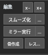

`編集` セクションには、`x-` / `x+` と、`スムーズ化` / `ミラー実行` / `骨作成` / `レストポーズ適用` があります。

### X 方向の頂点選択

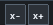

  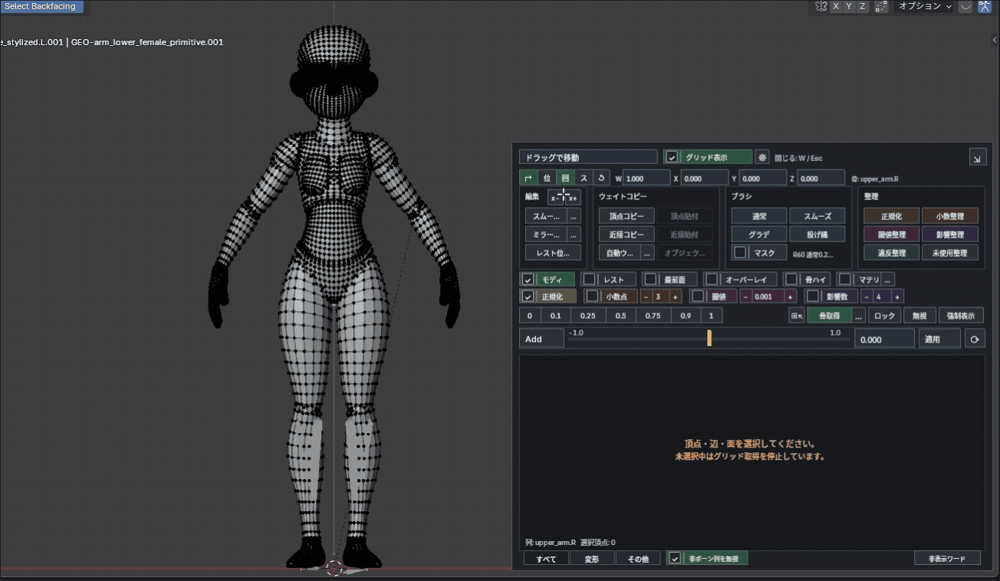

アーマチュア原点（無い場合はオブジェクト原点）を基準に、`x-` 側または `x+` 側の頂点を選択します。

- 通常クリック : 中心線上の頂点は選択しません。
- `Shift + クリック` : 中心線上の頂点だけを選択します。

### スムーズ化

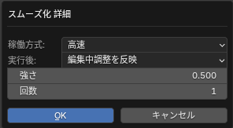

  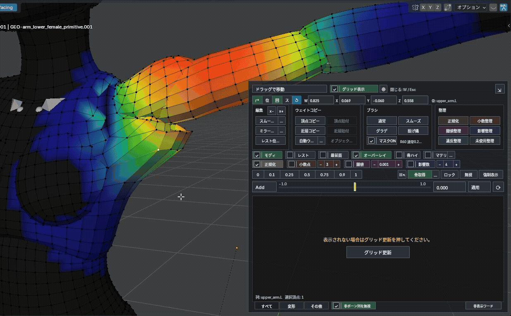

選択頂点のウェイトを周囲へなじませます。

- 通常クリック : 選択頂点をスムーズ化。
- `Shift + クリック` : 選択列にウェイトがある範囲と、その外側 1 リングを自動スムーズ。複数メッシュの編集時は、頂点未選択のメッシュも対象です。
- `Ctrl + クリック` : 周囲を基準に異常なウェイトを修正。
- 右隣の `…` : 対象範囲・方式（`高速` / `表面` / `ボリューム`）・回数・実行後の整理方法を調整。
- `Shift + クリック` 用の設定 : `周辺への広がり値`（初期値 `0.01`、`0` で外側への拡張なし）と `選択頂点のみ`（初期値 OFF）。`選択頂点のみ` を ON にすると、外側のリングも含めて選択頂点に限定します。

### ミラー実行

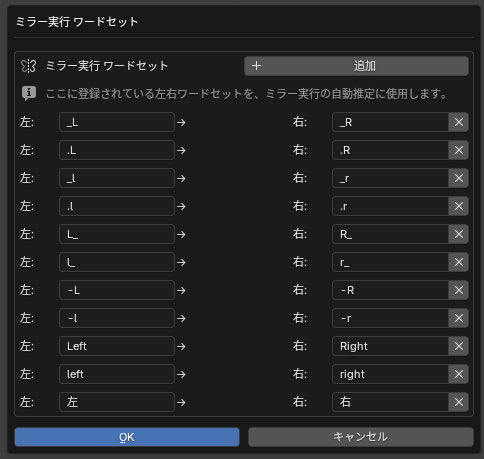

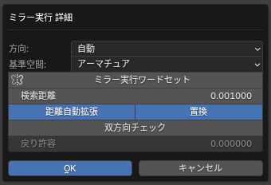

  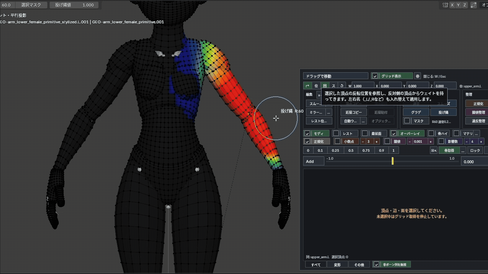

反転位置の反対側からウェイトを持ってきます。`_L` / `_R` などの左右名も入れ替えて適用されます。

- 通常クリック : 編集 / ウェイトペイントモードでは選択頂点をミラー。オブジェクトモードでは方向を選ぶダイアログを開き、選択メッシュ全体に実行します。
- `Ctrl + クリック` : 方向を選んで、対象オブジェクト全体（または選択頂点のみ）をミラー。
- 右隣の `…` : 詳細設定（方向・基準空間・検索距離・中央補正・中央許容・左右ワードセット）を開く。

補足。

- 複数メッシュに対応。選択頂点へのミラーは各メッシュの選択を使い、全体ミラーでは頂点未選択の編集メッシュも処理します。
- 左右非対称の形状にも対応します（近傍サーフェスへ投影して補間。詳細設定で無効化可）。
- 反対側の頂点グループが無くても、対応する反対側ボーンがあれば自動作成します（対応ボーンが無い場合は作成 / スキップを確認）。
- **中央 L/R 均等化**（デフォルト ON）: 中心軸上の頂点の L/R ウェイトを自動で均等化します。ミラー詳細の `中央頂点L/R補正` を OFF にするとこの均等化だけを省略できます。

### 骨作成

  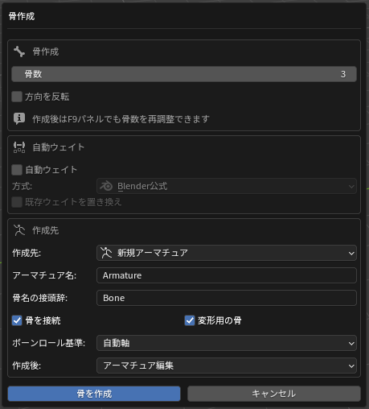
  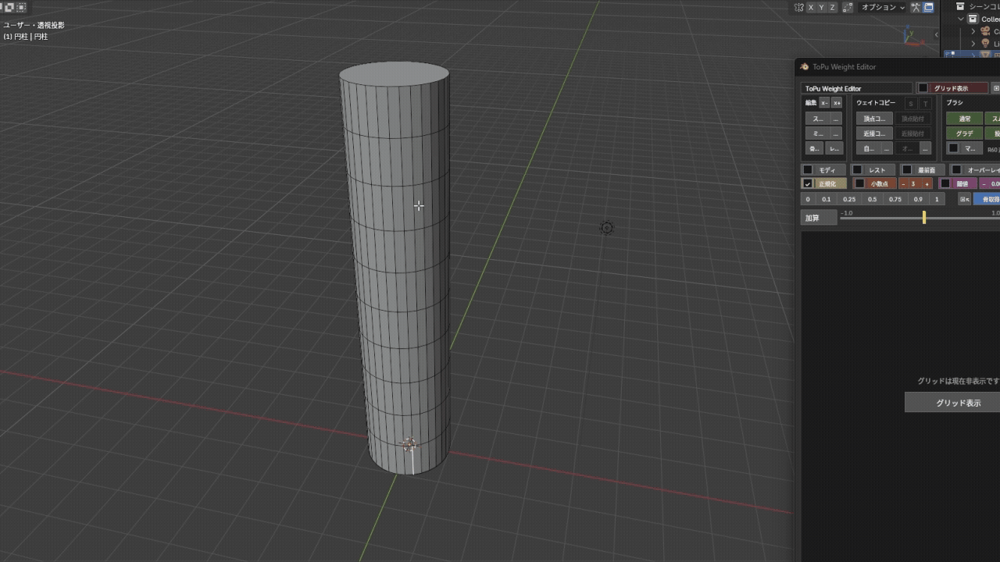

編集モードで選択した辺から、骨列または分岐した骨ツリーを作成します。

- 通常クリック : 選択辺に合う作成方法を自動判断し、確認ダイアログを開く（閉じた辺ループ / 開いた辺列 / 辺リング / 分岐辺に対応）。
- `Ctrl + クリック` : `骨作成設定`（初期設定）を開く。
- 骨の向きは、最後に選択したアクティブ辺が先端になります。
- `骨数` `方向を反転`（分岐時は `分岐数` も）は、確認ダイアログと `F9` から調整できます。確認ダイアログでは、自動ウェイト・作成先・名前・接続・ロール基準・作成後のモードも変更できます。
- 複数の開いた辺列 : `中心軸` OFF で各辺列に独立した骨列、ON で中央に 1 本の骨列を作成します。

`自動ウェイト`（確認ダイアログ内）: 作成した骨だけで対象範囲にウェイトを割り当てます（`Blender 公式` / `Voxel Heat Skinning`）。`既存ウェイトを置き換え` を有効にすると、対象頂点にある作成先アーマチュアの既存ボーンウェイトを消してから割り当てます。骨と無関係な頂点グループは残ります。

> 対象は基本的に選択頂点です。複数の開いた辺列で同じメッシュ帯を挟んでいる場合は、間にある未選択頂点も対象になります。つながっていない別メッシュには影響しません。`中心軸` でも同じ範囲を使います。

`ボーンロール基準` で、骨の長さ方向を保ったまま軸の向きを揃えます。

- `自動軸` : 骨列に合う基準軸を自動で選びます。
- `選択辺の面方向` : 選択辺につながる面の向きに揃えます。
- `メッシュのローカルZ` : メッシュ自身の Z 軸を基準にします。
- `メッシュのローカルY` : メッシュ自身の Y 軸を基準にします。
- `ワールドZ` : ワールドの Z 軸を基準にします。
- `ワールドY` : ワールドの Y 軸を基準にします。

#### 骨とウェイトの分割

  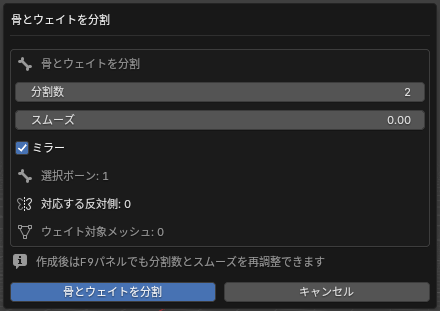

`骨作成` ボタンを `Shift + クリック` すると、既存の骨を連続した骨列へ分割し、対応する頂点グループのウェイトを再分配します。

- 対象 : 選択ボーン（ポーズ / オブジェクト / アーマチュア編集モード）、または TPWE のアクティブ列と同名の骨（メッシュ編集モード）。
- `分割数`（2〜64）と `スムーズ`（分割骨間の遷移幅、デフォルト `0`）を指定。
- `ミラー`（デフォルト ON）: 左右ワードセットを使って反対側も同じ設定で分割。
- 実行後は `F9` から `分割数` `スムーズ` `ミラー` を再調整できます。

### レストポーズ適用

  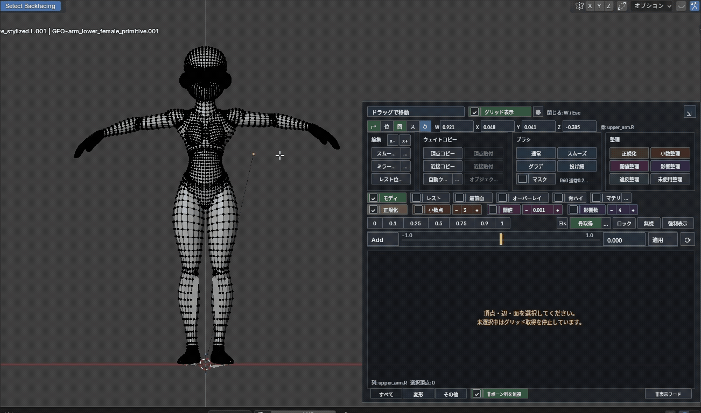

現在の見た目のポーズを、新しいレストポーズとして適用します。アクションとシェイプキーのリターゲットに対応しています。

> ※ アーマチュアのレストデータ、メッシュ / シェイプキーの座標、アクション、NLA 参照のアニメーションを変更する可能性があります。**実行前に必ずバックアップを取ってください。**

## ウェイトコピー

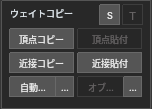

  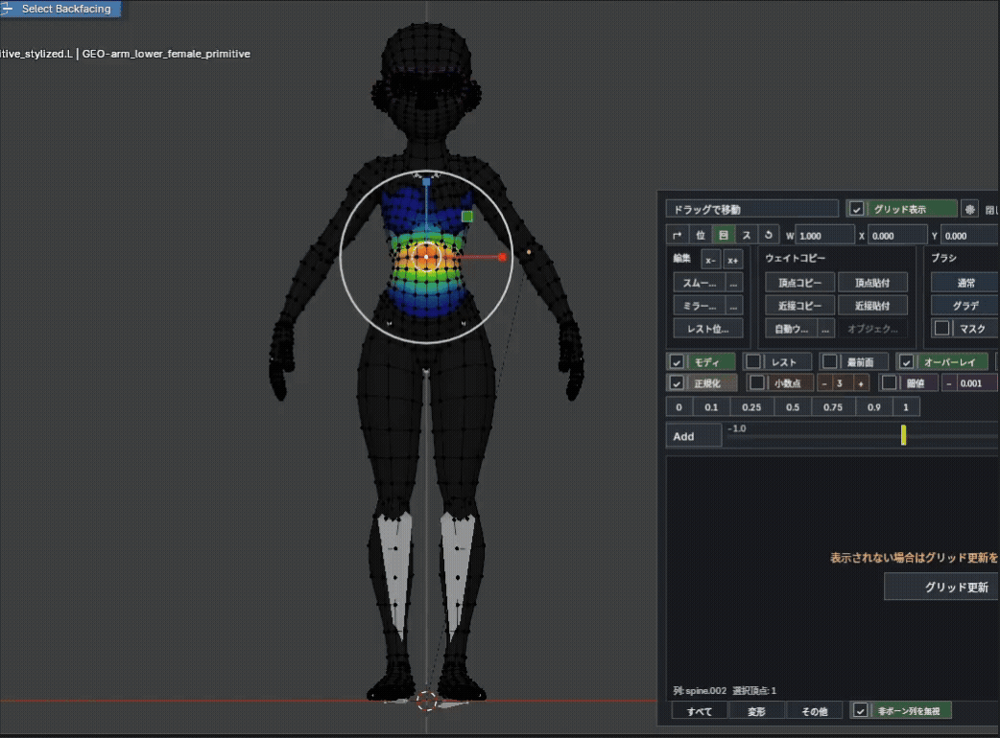

- `頂点コピー` / `頂点貼付` : アクティブ頂点のウェイトをコピーし、選択頂点へ貼り付け。
- `近接コピー` : 選択頂点の位置とウェイトを保存。
- `近接貼付` : 保存した位置をもとに、選択頂点へウェイトを貼り付け。`Shift + クリック` では、その貼り付けだけ `衣装裏面モード` を有効にします。
- 近接貼付の通常操作と `Shift + クリック` は、どちらも選択頂点が対象で、`オブジェクト転送` の詳細設定を共用します。Shift 操作で保存済み設定は変わりません。
- `自動ウェイト` : 選択メッシュをアーマチュアへ紐づけ、自動ウェイトを割り当て。
- `オブジェクト転送` : アクティブメッシュのウェイトを他の選択メッシュへ転送。

`自動ウェイト` と `オブジェクト転送` の右隣の `…` から、それぞれの詳細設定を開けます。

### S / T ボタン（列の転送）

見出しの右側にある `S` / `T` は、選択列に対する転送ショートカットです。

- `S` : 選択列を転送元に登録。
- `T` : 登録済みの転送元から現在の選択列へ転送。
- `Shift + T` : 転送元と選択列を入力済みの状態で `複数ウェイト転送` ダイアログを開く。

### オブジェクト転送

選択順の最後（アクティブ）のオブジェクトから、他の選択オブジェクトへウェイトを転送します。面ベースで転送するため、ローポリでも比較的きれいに転送されます（その分やや重め）。

- `Robust Weight Inpainting` : 一致しなかった領域を補完しながら転送。
- `衣装裏面モード` : 法線と距離を使って内側シェルの候補を優先。
- 転送先に Armature モディファイアが無い場合は自動で追加できます（デフォルト ON）。

### 自動ウェイト

  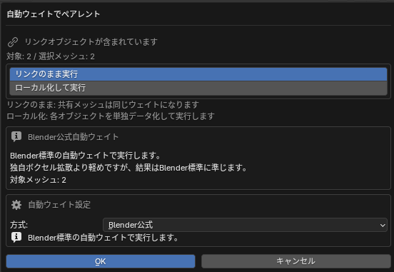
  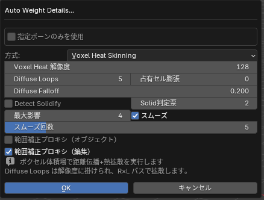

選択メッシュをアーマチュアへ紐づけ、自動ウェイトを割り当てます。オブジェクトモードでは選択メッシュ間の親子関係を維持できます（初期設定 ON）。選択頂点の部位だけを部分的にウェイト付けすることもできます。詳細設定で、Blender 公式方式と Voxel Heat Skinning を切り替えます。

**Voxel Heat Skinning の主な設定**

- `Voxel Heat 解像度` : 最長辺方向のボクセル数。大きいほど細部を保持しますが、処理時間とメモリが増えます。
- `Diffuse Loops` : 拡散パス数（解像度 × Loops）。大きいほど滑らかに伝播しますが重くなります。
- `占有セル膨張` : 表面ボクセルを広げ、薄い衣装などで伝播が途切れるのを抑えます。漏れる場合は `0`。
- `Diffuse Falloff` : 大きいほど遠方ボーンの寄与を減らし、局所的で締まったウェイトに。
- `距離フォールオフ` : 大きいほど近いボーンを強く優先。
- `Detect Solidify` : 薄い衣装やシェルに厚みを持たせます（ON では占有セル膨張が最低 1）。
- `Solid判定票` : 内部セルと判定するのに必要な票数。`2` は多数決、`1` は広め、`3` は厳しめ。
- `最大影響` : 1 頂点あたりのボーン数の上限（デフォルト `4`）。
- `スムーズ` / `スムーズ回数` : 自動ウェイト後に境界をなじませます（デフォルト ON・`5` 回）。
- `範囲補正プロキシ（オブジェクト）` : 表示中のメッシュを計算範囲の補正だけに使用。書き込み先は選択メッシュのみ（デフォルト OFF）。
- `範囲補正プロキシ（編集）` : 部分ウェイト時に、同じアーマチュアのメッシュや未選択頂点を計算補助に使用。書き込み先は選択頂点のみ（デフォルト OFF）。

> ※ 処理時間は解像度・`Diffuse Loops`・対象頂点数などで大きく変わり、実行中は Blender を操作できない場合があります。

**指定ボーンのみを使用**

ON にすると、保存したボーンリストだけで自動ウェイトを計算します（Blender 標準 / Voxel Heat の両方、オブジェクト / 編集モードの両方）。

- `選択ボーンを取得` : 編集 / ポーズ / オブジェクトモードのボーン選択を取り込む。
- `すべて` / `なし` とチェックリストで調整。
- `使用中を上へ`（デフォルト ON）: 有効にしたボーンを一覧の上へまとめる。

## ブラシ

  

GPU オーバーレイから、ビューポート上で使う独自のウェイトブラシを開始できます。編集モード / ウェイトペイントモードの両方で使え、ブラシ中でも骨取得や骨トランスフォームを併用できます。

- `F` でサイズ変更、`Tab` / `Q` / `Esc` で元のツールへ戻る。
- ツールヘッダーで、サイズ・選択マスク・各ブラシ値などを調整。
- HUD の `サイズ` 欄 : 左右ドラッグで変更、`Shift + ドラッグ` で微調整、クリックで直接入力。範囲は `1〜1000 px` で、`F` とツールヘッダーのサイズに連動します。
- 編集モードは複数メッシュ、ウェイトペイントモードはアクティブメッシュが対象です。
- 4 種類とも編集設定の正規化・小数点・閾値・影響数に対応します。

### 通常ブラシ

  

選択列のウェイトを加算 / 減算する基本ブラシです。

- 左ドラッグで加算、`Ctrl + 左ドラッグ` で減算。
- `Shift + 左ドラッグ` で一時的にスムーズ、`Ctrl + Shift + 左ドラッグ` で周辺の影響を広げる。
- `通常量` : 1 ストロークあたりの変化量。
- `一定塗` : 同じ頂点に重ねても塗りすぎないように塗る。
- `重ね塗` : 当たるたびに `通常量` を加減算し、なぞるほど強くなる。
- ツール設定の `貫通` : 手前の面に加え、奥に重なった面も塗ります。

### スムーズブラシ

  

ウェイトを周囲になじませるブラシです。通常は編集可能なグループをまとめて処理し、塗り跡やミラー後の境界を整えます。

- 左ドラッグでなめらかにする。
- `Shift + 左ドラッグ` : 指先でなぞるようにウェイトを移動。
- `Ctrl + 左ドラッグ` : 選択列の強いウェイトを周囲へ広げる。
- `Alt + 左ドラッグ` : 周囲の弱い値になじませ、選択列の影響を縮小。
- `アクティブグループのみ` : 選択列だけをスムーズにし、周囲に同じ列のウェイトがあれば、0 の頂点にも広げます。
- `強さ` で寄せ具合、`回数` で反復回数を調整。
- 無視列を選択している場合は、その無視列だけを処理。

`稼働方式` で挙動を切り替えます。

- `高速` : カーソル下の接続辺の周辺だけを処理（最も軽い）。
- `表面` : 接続トポロジーをたどってスムーズ（裏面へ貫通しない）。
- `ボリューム` : 空間的に近い頂点も参照し、局所密度に合わせてスムーズ（`ボリューム範囲` で届く範囲を調整）。

### グラデーションブラシ

  

ドラッグ方向に沿って、選択列のウェイトにグラデーションを作るブラシです。

- 通常の左ドラッグはグラデーションで置き換えます。
- `グラデ値` で最大値を調整（減衰カーブに沿ってこの値から 0 へ）。
- `Ctrl` で減算方向、`Shift` で加算方向。
- 種類 : `リニア`（直線）/ `放射`（開始点から外側へ）/ `線放射`（線から広がる）。
- `減衰` : `リニア` / `スムーズ` / `球状` / `ルート` / `シャープ`、または `カスタム`（`カスタム指数` `0.1〜8`）。

### 投げ縄ブラシ

  

囲んだ範囲を指定値で塗るブラシです。広い範囲を一気に 0 / 0.5 / 1.0 などへそろえたいときに向いています。

- 左ドラッグで範囲を囲むと、内側へ `投げ縄値` を適用。
- `Ctrl` で減算方向、`Shift` で加算方向。
- ブラシサイズは、境界をなじませる幅として使われます。

### 選択マスク

  

`マスク` を ON にすると、ブラシの影響先を選択中の頂点だけに制限します。近い別パーツや裏側の頂点へ意図せず塗るのを防げます。すべてのブラシで共通して使えます。頂点が未選択の場合は塗れません。

## 整理

  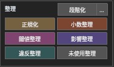

- `正規化` : 選択頂点のウェイト合計を 1.0 に整える。
- `小数整理` : ウェイト値を指定桁で整理（`0` 桁では無効）。
- `閾値整理` : しきい値以下の低いウェイトを 0 に。
- `影響整理` : 頂点あたりの最大影響数を上限に収める。
- `違反整理` : 正規化・小数・閾値・影響数の設定でまとめて整理。
- `未使用整理` : 未使用の頂点グループを削除。
- `段階化` : 3D ビューの実行ダイアログから、ウェイトを一定の刻みへ揃えます。各頂点の合計を維持し、実行後は `F9` で刻みを再調整できます。`…` からも刻みを設定できます。

> ※ 基準値は[編集設定 / 自動整理の基準値](#編集設定--自動整理の基準値)で設定します。オブジェクトモードで実行するとオブジェクトの全頂点が対象になります。中心軸上で実行前から等しい L/R ペアは、等しいまま処理されます。

## 表示補助

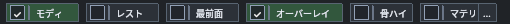

  

- `モディ` : 対象メッシュの Armature モディファイア表示（ポーズ変形）を切り替え。複数編集とオブジェクトモードの複数選択に対応し、モディファイアがないメッシュは除外します。
- `レスト` : ON でレスト位置、OFF でポーズ位置。対象アーマチュアがない場合、`レスト` と `最前面` は使用できません。
- `最前面` : アーマチュアの最前面表示を切り替え。
- `オーバーレイ` : Blender の頂点グループウェイト表示を切り替え。
- `骨ハイ` : アクティブ頂点グループ（無い場合は選択列）に対応するボーンを、編集 / ウェイトペイント時だけハイライト。ON 状態は保存されます。
- `マテリ` : ウェイトカラープレビューを切り替え。横の `…` で色（色相 / 彩度 / 輝度）とマテリアル置換を設定。

### ウェイトカラープレビュー

  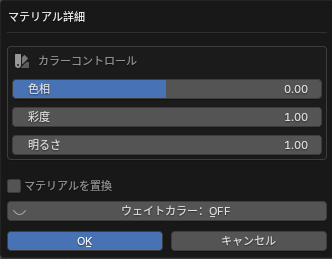

`マテリアル` を ON にすると、選択メッシュのウェイトをカラー表示します。選択を外したメッシュは元の表示へ戻ります。

- `標準ウェイト色`（初期設定）: アクティブグループを青〜赤で表示し、ウェイト 0 は暗い灰色で表示します。
- `カラフル合成` : 複数グループの色を合成して表示します。
- 横の `…` で表示方式・色・マテリアル置換を設定します。

- 専用の一意な名前のカラー属性を作成します（同名のユーザー属性は上書き・削除しません）。
- `マテリアル置換`（デフォルト OFF）: ON のときだけマテリアルスロットを一時的に置き換え、解除時に元へ復元。共有メッシュでは置換をスキップ。

> 表示負荷はメッシュの大きさや選択数によって変わります。

## 編集設定 / 自動整理の基準値

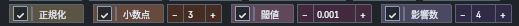

`正規化` `小数点` `閾値` `影響数` の 4 項目で、[整理](#整理)実行時の基準値を決めます。

- チェックを入れた項目は、値を変更する際に自動で整理されます。
- `−` `+` ボタン、または数値欄への直接入力で変更。
- `小数点` は `0〜7` 桁。`0` では小数整理と小数違反の検査だけを無効にし、正規化・閾値・影響数の検査は続けます。
- `影響数` の右の `…` から `影響数整理設定` を開けます。

**影響数整理設定**（影響数が上限を超えたとき、どのボーンを残すか）

- `親子関係を考慮`（デフォルト）: 共通の親から枝分かれしたボーンの系統（例: 腰から分かれる左脚・右脚）ごとに、影響が残るように配分します。スカートのように複数の脚から影響を受ける頂点でも、片方の脚が丸ごと消えにくくなります。
- `値を優先` : 一般的な整理方法で、ウェイトが大きいボーンから順に残します。
- `近似ウェイト幅`（初期値 `0.001`）: 階層を優先して残す順番を調整できるウェイト差。階層がないグループは `値を優先` で処理します。
- 整理で除いたウェイトは、階層上で近い残存ボーンへ渡します。同じ距離なら親を優先します。

> ※ 自動整理は確実ではないため、最後に `違反整理` などで確認することを推奨します。

## 値プリセット / 入力 / 適用

### プリセットボタン

  

`0` `0.1` `0.25` `0.5` `0.75` `0.9` `1` をワンクリックで適用できます。`Add` / `Add%` モードでは `Shift + クリック` で負方向に適用します。プリセット値はアドオンプリファレンスで変更できます。

### 入力モード / スライダーと数値欄

  

左端のボタンで入力モードを `ABS` → `ADD` → `ADD%` の順に切り替えます。

- `Abs` : 入力値で置き換え。
- `Add` : 現在値に加算（負の値で減算）。
- `Add%` : 現在値に対して割合で加算。

操作方法。

- スライダーのドラッグでリアルタイムに適用（**1 万頂点以上**では、離して確定した時点で適用）。
- 数値欄はクリックで直接入力、上でホイールすると少しずつ変更。
- `適用` : 数値欄の値を選択頂点の現在列に適用。
- `⟳` : 現在の選択頂点でグリッドを手動更新（特殊な選択コマンドの後などに）。
- `Ctrl + ホイール` でウェイトを加減算、`Ctrl + Shift + ホイール` で微調整。セル選択があればそのセルを優先し、なければ現在列が対象です（増減量はプリファレンスで変更可）。

## 特殊グループ選択 / 骨取得

  

`骨取得` を使うと、ビューポート上のボーンをクリックして、そのボーン名の頂点グループ列を選択できます。複数の Armature モディファイアがある場合は最も近い候補を取得します。

- 表示中は、デフォルトで `Alt + 右クリック` からも骨取得できます（`骨取得` ボタンの `Shift + クリック` で ON / OFF）。
- 右隣の `…` : 除外ワード（`IK` `FK` `twist` などを候補から外す）とショートカットを設定。
- `▣↖` が ON のとき : 選択頂点が変わるたびに、最もウェイト値が高い列を自動選択。頂点を切り替えながら主影響ボーンを確認する作業に向きます。

## 列状態 / 表示条件（ロック / 無視 / 強制表示）

  

- `ロック` : 選択列を編集できない状態にする。
- `無視` : 対象列を合計・正規化・整理の対象外にする。
- `強制表示` : 0 ウェイトの列でもグリッドに表示する。
- `Shift + クリック` で選択列以外を対象に作用、`Alt + クリック` で状態をすべて解除。
- `Ctrl + 強制表示` : 文字フィルターを開き、カンマ区切りの複数ワードに部分一致する列をまとめて強制表示。

## グリッド操作 / 下部タブ

### 列ヘッダー

  

  

  

- クリック : その列が選択列になる。
- `Shift + 列クリック` : その頂点グループに値がある頂点をまとめて選択。
- `Ctrl + 列クリック` : 選択中の頂点のうち、その列に値がある頂点だけを残す。
- `Ctrl + Shift + 列クリック` : その列の全セルを、現在のセル選択に追加（全ページの表示行が対象）。
- 右クリック : [ウェイト転送メニュー](#列右クリックのウェイト転送)を開く。

### L / 頂点 / 合計

  

- `L` : 対象頂点をウェイトロック（`Alt + クリック` で解除）。各行の `L` セルでも切り替えられ、ドラッグでまとめて変更できます。
- `頂点` : 表示行をまとめてグリッド選択（`Alt + クリック` で解除）。各行の頂点番号はクリックで選択を切り替え、ドラッグで範囲選択、`Shift + クリック` で追加、`Ctrl + ドラッグ` で解除します。
- `合計` : **違反のみ表示**を切り替え（`Shift + クリック` で表示中の頂点をメッシュ選択）。
- 影響数や合計値に問題がある頂点があると、`合計` ヘッダーが `合計 ⚠` に変わります。
- 違反のみ表示は全ページの違反行が対象です。この表示中の `L` / `頂点` ヘッダー操作も、ページ外の違反行を含みます。`合計` の `Shift + クリック` は現在の表示対象全体をメッシュ選択します。
- 合計セルの警告色は、合計・影響数・小数点・閾値の理由を示します。マウスを重ねると詳細を確認できます。

### セル

  

- クリック : 数値を直接入力（`Enter` で確定）。先頭に `+` `-` `*` `/` で現在値へ演算（例: `*0.5`、`+0.1`）。
- ドラッグ : 範囲選択（`Shift + ドラッグ` で追加、`Ctrl + ドラッグ` で解除）。
- 右クリック、またはグリッドの空白をクリック : セル選択を解除。
- `Ctrl + Shift + クリック` : そのセルの列全体を現在のセル選択に追加。全ページの表示行が対象で、列ヘッダーからも同じ操作ができます。
- 複数セル選択中は、入力値をまとめて適用。選択セルが残っている間は、スライダー / ホイール / プリセット / 適用など全ての値変更で実メッシュ選択より優先されます。

### 表示タブ

  

  

グリッド下部のタブで、表示する列の種類を切り替えます。

- `すべて` : ボーン列と非ボーン列を表示。
- `変形` : ボーン名と一致する変形用の列だけを表示。
- `その他` : ボーン名と一致しない非ボーン列だけを表示。

スクロールバーで縦横に移動できます。グリッド上のホイールは縦、`Shift + ホイール` は横スクロールです。フッターに現在列と選択頂点数を表示します。

タブごとのオプション。

- `非ボーン列を無視`（すべてタブ）: 非ボーン列を合計・正規化・整理から除外します。手動の無視設定は対象を切り替えても保持されます。
- `階層`（すべてタブ、初期設定 ON）: オブジェクトの親をたどり、親階層にあるアーマチュアの骨もボーン列の判定に含めます。OFF では Armature モディファイアだけで判定します。
- `作成済み常時`（その他タブ）: 値が入っていなくても、作成済みの非ボーン列を常に表示。
- `不正規許可`（その他タブ）: ON のとき、その他列は合計が 1 以上でも違反にせず、正規化もしない。
- `非表示ワード` : 列名から指定文字だけを省略します。列そのものは隠さず、実際の頂点グループ名も変えません。

複数編集では、いずれかのメッシュの対象アーマチュアに同名の骨があれば、その名前をボーン列として扱います。`その他` タブの無視設定は独立しています。

### 列右クリックのウェイト転送

  

列ヘッダーを右クリックすると、頂点グループ間の転送メニューを開けます。

- `転送元に指定` / `この列へ転送` : 右クリックした列を転送元にし、現在の列へ転送。
- `複数ウェイト転送` : 転送元・転送先・処理方法（`コピー` / `移行` / `置換`）・対象範囲（グループ全体 / 選択頂点）を指定して転送。複数ペアをまとめて処理できます。

## 複数オブジェクト編集

複数のメッシュを同時に編集モードにしていると、グリッドのフッターに現在列・選択頂点数・`複数編集: N obj` が表示され、複数オブジェクトの頂点をまとめて扱えます。

また `プロパティ > オブジェクトデータ > 頂点グループ` パネルに `選択を同期` ボタンが追加され、ON にするとオブジェクト間で頂点グループの選択を同期します。

## アドオンプリファレンス

GPU オーバーレイの `⚙` ボタン、または `編集 > プリファレンス > アドオン` から開けます。

- UI の言語は Blender の `プリファレンス > インターフェイス > 翻訳` に従います。
- `表示設定` : ツールヘッダーへの GPU オーバーレイボタン表示。
- `GPUオーバーレイ UI倍率` : `3DビューHUD` と `専用エリア / ウィンドウHUD` の倍率を個別に設定。
- `GPUオーバーレイ UIスタイル` : `UIの角を少し丸める`。
- `GPUオーバーレイ カラーテーマ` : ビルトインパレット（20 種）とユーザーセット、プリセットのインポート / エクスポート。
- `GPUオーバーレイ プリセット値` : プリセットボタンの値を変更。
- `スクロール変更量` : `Ctrl + ホイール` / `Ctrl + Shift + ホイール` の増減量。
- `影響数整理の初期方式` : `親子関係を考慮`（デフォルト）または `値を優先`。
- 左右ワードセット : ミラー実行の自動推定に使う左右ワードのペアを登録。
- `追加ショートカット` : スムーズ化 / 骨からインフルエンス選択はデフォルト OFF、HUD 中の骨取得は ON。
- `ショートカット設定` : 登録済みキーマップの確認・変更。
- `一括ウェイト処理・ミラー デバッグ` : 処理時間やミラーの転送元 / 転送先をコンソールへ出力。

> ※ `自動` 倍率は OFF にすると `0.50〜4.00` の手動倍率を指定でき、HUD の倍率ボタンと連動します。

  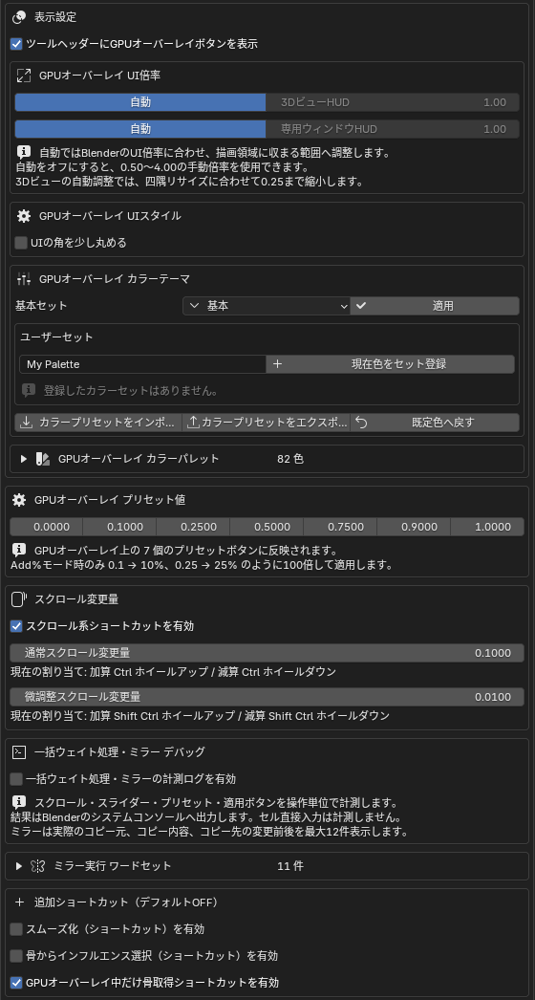
　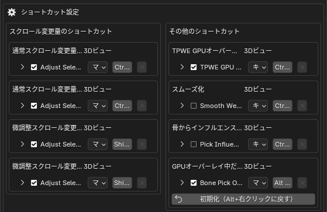

## ショートカット

| 操作 | デフォルト | 初期状態 |
| --- | --- | --- |
| GPU オーバーレイ表示 / 非表示 | `Ctrl + W` | 有効 |
| GPU オーバーレイを閉じる | `Ctrl + W` / `Esc` | 有効 |
| 選択セル / 現在列のウェイト加算・減算 | `Ctrl + ホイール` | 有効 |
| 選択セル / 現在列のウェイト微調整 | `Ctrl + Shift + ホイール` | 有効 |
| 列全体をセル選択へ追加 | `Ctrl + Shift + クリック`（列名 / セル） | 有効 |
| GPU オーバーレイ中の骨取得 | `Alt + 右クリック` | 有効 |
| スムーズ化 | `Ctrl + Alt + S` | 無効 |
| 骨からインフルエンス選択 | `Ctrl + Alt + B` | 無効 |

> ※ ショートカットはアドオンプリファレンスから確認・変更できます（骨トランスフォームの右ドラッグを除く）。

## blend ファイルへの変更について

このアドオンはネットワークにアクセスせず、外部プログラムの実行や Python パッケージのインストールも行いません。外部ファイルの読み書きは、`カラープリセットのインポート` / `エクスポート` を選んだときだけです。

一部の機能は、意図的に現在の blend ファイルを変更します。

- **専用エリア / ウィンドウ** : 識別情報とエリアタイプを Screen / Workspace に保存（OS ウィンドウ位置は保存しない）。
- **ウェイトスナップショット** : 圧縮してテキストデータブロックに保存（大きいとファイルサイズが増える）。
- **骨トランスフォーム** : 取り消し用データをテキストデータブロックとして作成し、不要なものは自動削除。
- **骨作成 / 骨とウェイトの分割** : アーマチュアへ骨を追加し、頂点グループのウェイトを再分配。
- **ウェイトカラープレビュー** : 専用のカラー属性を作成（`マテリアル置換` ON 時のみマテリアルを一時置換）。
- **レストポーズ適用** : レストデータ・座標・アクション・NLA 参照アニメーションを変更する可能性あり。実行前にバックアップを推奨。
- **自動ウェイト** : 計算中に一時データを作成し、終了時に削除。
- **オブジェクト転送** : 転送先に Armature モディファイアが無ければ追加できる（デフォルト ON）。

> 不具合の報告や再現用ファイルは [Issue トラッカー](https://github.com/http4211/ToPu_weight_editor/issues) へお願いします。

## ライセンス / サードパーティ表記

本体は GPL-3.0-or-later です。

- **Robust Weight Inpainting** : [RobustSkinWeightsTransferCode](https://github.com/rin-23/RobustSkinWeightsTransferCode)（Rinat Abdrashitov 氏、MIT ライセンス）をもとに Blender 向けに改変。libigl / Polyscope の同梱・要求はありません。原文表示は `LICENSES/RobustSkinWeightsTransferCode-MIT.txt`。
- **GPU オーバーレイのカラーパレット** : 20 種のビルトインパレットはユーザー提供の Blender テーマ拡張から取り込み。`Blender Dark` / `Blender Light` は Blender 標準のテーマ設定に基づきます。詳細は `LICENSES/BlenderThemePalette-Attributions.txt`。
