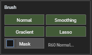
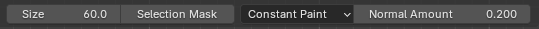
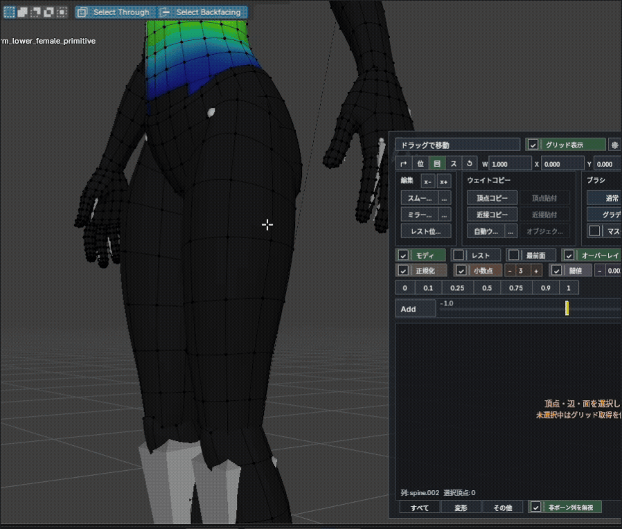
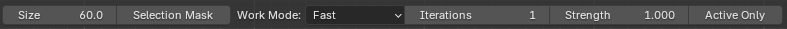
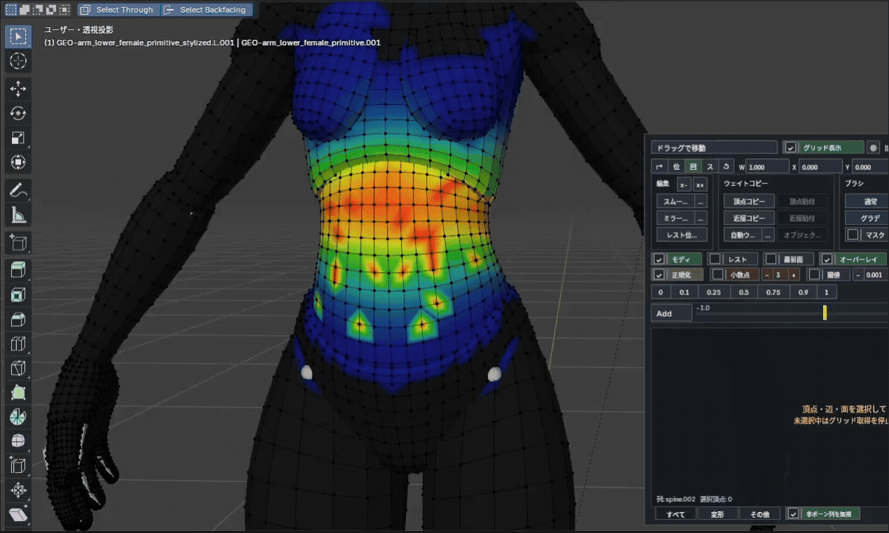
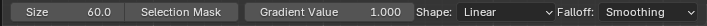
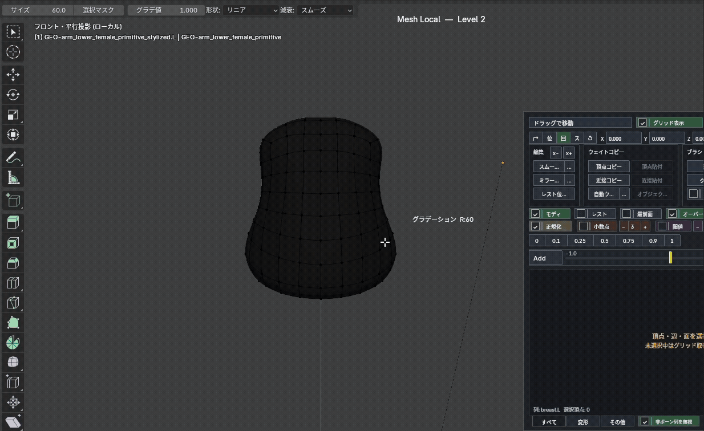
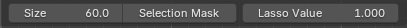
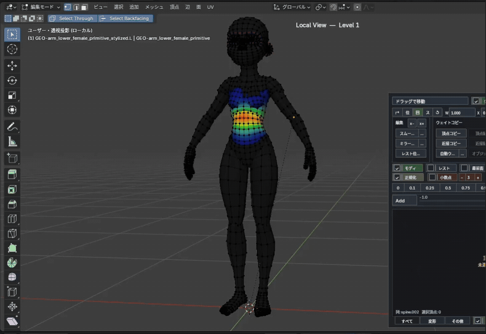
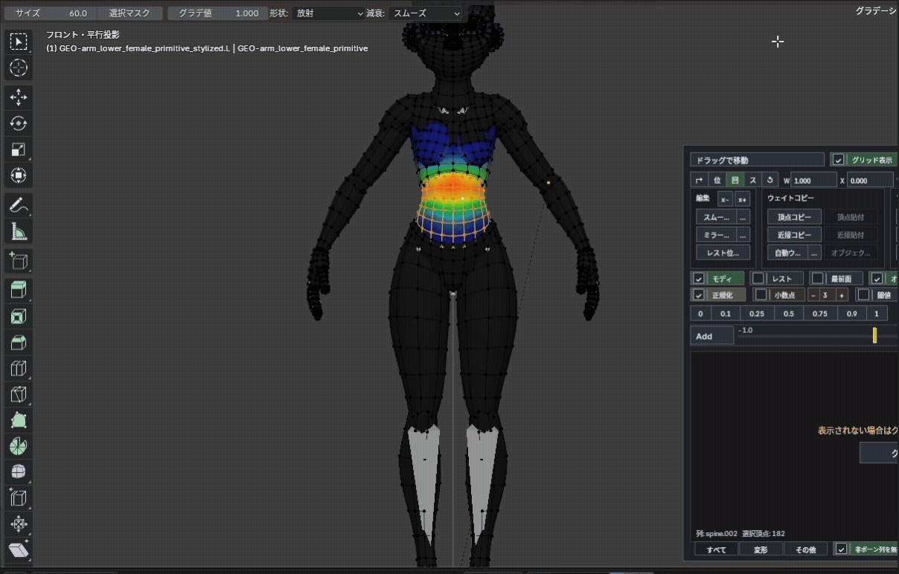

# Brushes

  

The overlay can start the add-on's own weight brushes, used directly in the viewport. They work in both Edit Mode and Weight Paint Mode, and bone picking / bone transform stay available while brushing.

- `F` changes the size; `Tab` / `Q` / `Esc` return to the previous tool.
- The tool header exposes size, selection mask and each brush’s value.
- HUD `Size`: drag horizontally to change, `Shift + Drag` for fine adjustment, or click to type. The range is `1–1000 px`, shared with `F` and the tool header.
- Edit Mode supports multiple meshes; Weight Paint targets the active mesh.
- All four brushes support the editing settings for normalization, decimals, threshold and influence count.

### Normal brush

  

The basic brush that adds to or subtracts from the selected column.

- Left-drag adds; `Ctrl + Left-drag` subtracts.
- `Shift + Left-drag` temporarily smooths; `Ctrl + Shift + Left-drag` spreads surrounding influences.
- `Normal Amount` — how much one stroke changes.
- `Constant Paint` — avoids over-layering when the same vertex is hit repeatedly.
- `Stack Paint` — adds/subtracts `Normal Amount` on every touch, building up gradually.
- `Through` in the tool settings — also paints layered surfaces behind the frontmost surface.

### Smoothing brush

  

Blends weights with the surrounding vertices. By default, it processes editable groups together to soften paint edges and seams left after mirroring.

- Left-drag smooths the weights around the cursor.
- `Shift + Left-drag` — moves weights like a fingertip.
- `Ctrl + Left-drag` — spreads the selected column’s stronger weights outward.
- `Alt + Left-drag` — blends toward weaker nearby values to shrink the selected column’s influence.
- `Active Group Only` — smooths only existing weights in the active group, without spreading to zero-weight vertices.
- `Strength` — how far values move toward their neighbours; `Iterations` — how many passes run.
- When an ignored column is selected, only that ignored column is processed.

`Work Mode` switches the behavior.

- `Fast` — processes only the connected edges under the cursor (lightest).
- `Surface` — walks connected topology (does not bleed to the back side).
- `Volume` — also references spatially-near vertices to match local density (`Volume Range` tunes the reach).

### Gradient brush

  

Builds a weight gradient along the drag direction.

- Plain left-drag replaces weights with the gradient.
- `Gradient Value` — the maximum weight (the falloff curve runs from this value down to 0).
- Hold `Ctrl` for the subtract direction, `Shift` for the add direction.
- Type — `Linear` (straight) / `Radial` (outward from the start point) / `Line Radial` (spreads from the dragged line).
- `Falloff` — `Linear` / `Smooth` / `Sphere` / `Root` / `Sharp`, or `Custom` (`Custom Exponent` `0.1`–`8`).

### Lasso brush

  

Fills an enclosed area with a set value. Good for flattening a wide area to 0 / 0.5 / 1.0 in one action.

- Left-drag to enclose an area; `Lasso Value` is applied inside it.
- Hold `Ctrl` for the subtract direction, `Shift` for the add direction.
- The brush size is used as the width that blends the boundary.

### Selection mask

  

Turning `Mask` on restricts the brush to the currently selected vertices. Helps avoid painting nearby parts or back-side vertices by accident. Shared by all brushes. If no vertices are selected, painting does not run.
