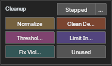

# Cleanup

  

- `Normalize` — normalizes the weight total of the selected vertices to 1.0.
- `Clean Decimals` — rounds weight values to the configured digits (disabled at `0`).
- `Threshold Cleanup` — zeroes weights at or below the threshold.
- `Limit Influences` — brings each vertex within the maximum influence count.
- `Fix Violations` — applies normalize, decimals, threshold and influence-count settings together.
- `Unused` — deletes unused vertex groups.
- `Stepped` — opens an execution dialog in the 3D View and snaps weights to a fixed step while keeping each vertex total. Use `F9` afterwards to adjust Step Size; `…` also sets the step size.

> Reference values come from **Edit Settings / Auto-cleanup reference values**. Run in Object Mode, these act on every vertex of the object. Editable center-axis L/R pairs that were already equal stay equal.

---

## Edit Settings / Auto-cleanup reference values

  

`Normalize`, `Decimals`, `Threshold` and `Influence Count` set the reference values used by the **Cleanup** buttons.

- Checked items are applied automatically whenever the add-on changes a value.
- Use the `−` / `+` buttons, or type into the value field, to change a value.
- `Decimal Places` ranges from `0–7`. `0` disables decimal cleanup and decimal violations; normalization, threshold and influence-count checks remain active.
- The `…` on `Influence Count` opens `Influence Cleanup Settings`.

**Influence Cleanup Settings** (which bones to keep when a vertex exceeds the influence limit)

- `Consider Bone Hierarchy` (default) — keeps influences spread across the separate chains that branch off a shared parent bone (for example the left and right legs splitting from the hip), so a vertex driven by several chains (a skirt influenced by both legs) is less likely to lose one whole chain.
- `Prefer Weight Values` — the ordinary approach: keeps the highest-weighted bones first.
- `Similar Weight Range` (default `0.001`) — the weight difference within which hierarchy can change the retention order. Groups without a hierarchy use `Prefer Weight Values`.
- Removed weight goes to the nearest retained bone in the hierarchy; a retained parent wins an equal-distance tie.

> Automatic cleanup is not guaranteed to catch everything, so running `Fix Violations` as a final check is recommended.
