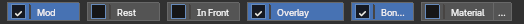
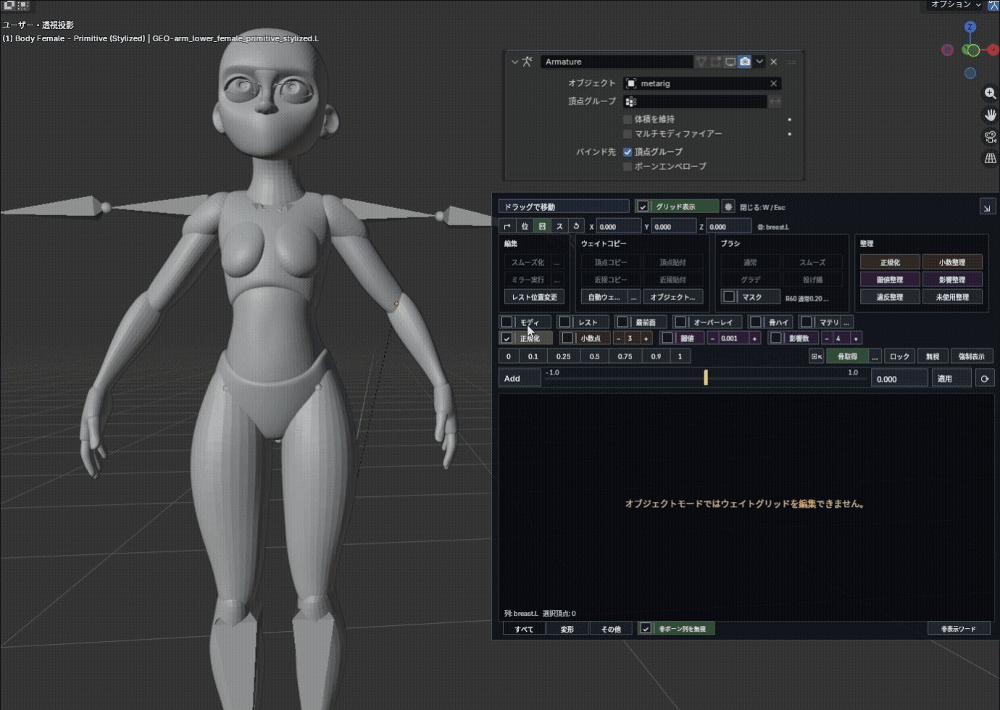

# Display Helpers

## Display helpers

  

- `Mod` — toggles Armature modifier display (pose deformation) across the current targets, including multi-edit and Object Mode multi-selection. Meshes without an Armature modifier are skipped.
- `Rest` — on for Rest Position, off for Pose Position. `Rest` and `In Front` are unavailable without a target armature.
- `In Front` — toggles In Front display for the armatures.
- `Overlay` — toggles Blender's Vertex Group Weights display.
- `Bone Hi` — highlights the bone matching the active vertex group (or the selected column), in Edit / Weight Paint Mode only. Its enabled state is restored on reload.
- `Material` — toggles the weight-color preview. The `…` next to it configures color (hue / saturation / value) and material replacement.

### Weight-color preview

`Material` previews weights on selected meshes. Deselected meshes return to their original display.

- `Active Weight` (default) — shows the active group from blue to red, with zero weights in dark gray.
- `Colorful Blend` — combines colors from multiple groups.
- Use the adjacent `…` to choose the mode, colors and material replacement.

- Creates a uniquely named, add-on-owned color attribute (it never overwrites or deletes a same-named user attribute).
- `Replace Materials` (off by default) — only when on does it temporarily replace material slots, restoring them when the preview is disabled. Skipped on shared mesh data.

> Preview performance depends on mesh size and the number of selected meshes.
