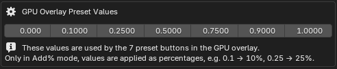
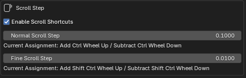
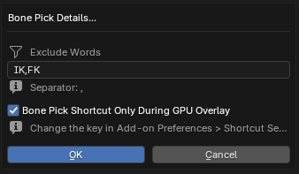
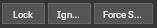
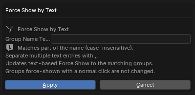
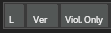
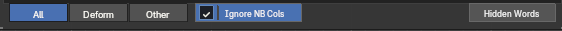
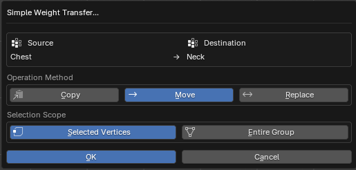
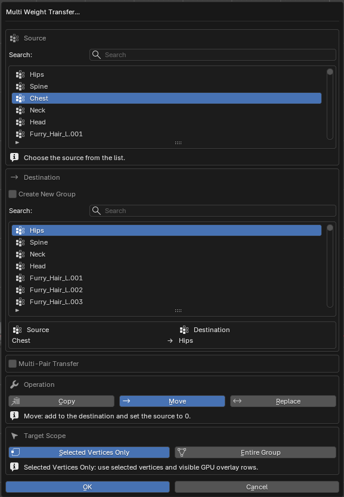

# Grid Controls

## Presets, Input & Apply

### Preset buttons

  

Applies `0`, `0.1`, `0.25`, `0.5`, `0.75`, `0.9` or `1` in one click. In `Add` / `Add%` mode, `Shift + Click` applies the negative value. Preset values can be changed in the add-on preferences.

### Input mode, slider and value field

  

The leftmost button cycles the input mode through `ABS` → `ADD` → `ADD%`.

- `Abs` — replaces the value with the entered one.
- `Add` — adds to the current value (negative values subtract).
- `Add%` — adds a percentage of the current value.

Usage.

- Dragging the slider applies in real time (with **10,000+ target vertices**, weights are committed on release).
- Click the value field to type; scroll the wheel over it to nudge the value.
- `Apply` — applies the value field to the current column of the selected vertices.
- `⟳` — rebuilds the grid from the current selection (useful after special selection commands).
- `Ctrl + Wheel` adjusts weights; `Ctrl + Shift + Wheel` uses finer steps. Selected cells take priority; otherwise the current column is used. Step sizes are set in preferences.

---

## Special Group Selection / Pick Bone

  

`Pick Bone` lets you click a bone in the viewport to select the vertex-group column with that bone's name. With several Armature modifiers, the globally nearest visible bone is used.

- While the overlay is open, `Alt + Right Click` also starts bone picking by default (`Shift + Click` on `Pick Bone` toggles it).
- The `…` opens the excluded-word and shortcut settings (excluded words keep bones containing `IK`, `FK`, `twist` and similar out of the candidates).
- When `▣↖` is on, changing the selection automatically selects the highest-weight column. Suits switching vertices often to check the dominant influence bone.

---

## Column State & Visibility (Lock / Ignore / Force Show)

  

- `Lock` — makes the selected column non-editable.
- `Ignore` — excludes the column from totals, normalization and cleanup.
- `Force Show` — keeps a column in the grid even when its weights are zero.
- `Shift + Click` applies to every column except the selected one; `Alt + Click` clears the state everywhere.
- `Ctrl + Force Show` opens a text filter to force-show every group matching comma-separated fragments.

---

## Grid Controls & Bottom Tabs

### Column headers

  

- Click — makes it the selected column.
- `Shift + Click` — selects every vertex that has a value in that group.
- `Ctrl + Click` — keeps only the current-selection vertices that have a value in that column.
- `Ctrl + Shift + Click` — adds every cell in that column to the existing cell selection, including displayed rows on later pages.
- Right-click — opens the **weight transfer menu**.

### L / Ver / Sum

  

- `L` — weight-lock the target vertices (`Alt + Click` unlocks). Each row's `L` cell also toggles the lock (drag for several).
- `Ver` — grid-select the displayed rows (`Alt + Click` clears). Click a vertex number to toggle its row selection, drag to select a range, `Shift + Click` to add, or `Ctrl + Drag` to remove.
- `Sum` — toggle **violation-only view** (`Shift + Click` selects the vertices shown in the grid).
- When some vertices have a total-value or influence-count problem, the `Sum` header changes to `Sum ⚠`.
- Violation-only view covers every page. In this view, `L` / `Ver` header actions also include matching rows on later pages. `Shift + Click` on `Sum` selects the entire current display set as mesh vertices.
- Total-cell warning colors identify sum, influence-count, decimal or threshold problems. Hover to see the reasons.

### Cells

  

- Click — type the value directly (`Enter` confirms). Start with `+` `-` `*` `/` for a relative operation (for example `*0.5` or `+0.1`).
- Drag — select a range (`Shift + Drag` adds, `Ctrl + Drag` removes).
- Right-click, or click empty grid space — clear the cell selection.
- `Ctrl + Shift + Click` — adds the cell’s whole column to the existing selection, including displayed rows on later pages (also available from the column header).
- With several cells selected, the entered value applies to all at once. While a cell selection remains, every value-changing operation (slider / wheel / presets / Apply) prioritizes the selected cells over the live mesh selection.

### Column tabs

  
  

The tabs below the grid choose which columns are shown.

- `All` — bone columns and non-bone columns.
- `Deform` — only deform vertex groups whose names match a bone.
- `Other` — only non-bone vertex groups that do not match a bone name.

Use the scrollbars to move vertically or horizontally. Over the grid, the wheel scrolls vertically and `Shift + Wheel` scrolls horizontally. The footer shows the current column and selected-vertex count.

Per-tab options.

- `Ignore Non-Bone Columns` (All tab) — excludes non-bone columns from totals, normalization and cleanup. Manual Ignore choices survive target changes.
- `Hierarchy` (All tab, on by default) — includes armatures along the object’s parent chain when classifying bone columns. When off, only Armature modifiers are used.
- `Always Show` (Other tab) — always shows existing non-bone columns even when the selection has no values for them.
- `Allow >1` (Other tab) — when on, Other columns are not treated as violations at a total of 1 or more, and are not normalized.
- `Hidden Words` — removes only the specified text from displayed column names. It does not hide columns or rename actual vertex groups.

In multi-edit, a shared name is a bone column if any edited mesh’s applicable armature contains that bone. The `Other` tab has its own independent Ignore state.

### Column right-click weight transfer

  
  

Right-clicking a column header opens the vertex-group transfer menu.

- `Set as Transfer Source` / `Transfer to This Column` — make the right-clicked column the source and transfer into the current column.
- `Multi Weight Transfer` — transfer with explicit source, destination, method (`Copy` / `Move` / `Replace`) and scope (whole group / selected vertices). Several pairs can be processed together.

---

## Multi-object editing

When several meshes are in Edit Mode at once, the grid footer shows the current column, selected-vertex count and a multi-edit indicator (`N obj`), and the vertices of all objects are handled together.

A `Sync Selection` button is also added to `Properties > Object Data > Vertex Groups`; turning it on synchronizes the vertex-group selection across the objects.
