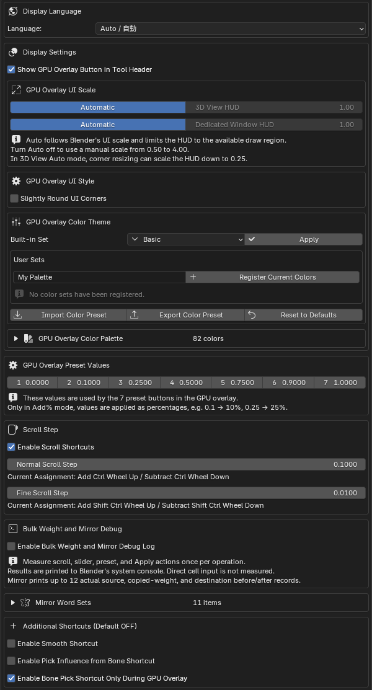
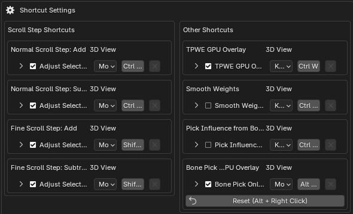

# Preferences & Shortcuts

## Add-on preferences

Open them with the `⚙` button in the overlay, or from `Edit > Preferences > Add-ons`.

- UI language follows Blender's `Preferences > Interface > Translation` settings.
- `Display Settings` — whether the GPU overlay button is shown in the tool header.
- `GPU Overlay UI Scale` — separate scales for the `3D View HUD` and the `Dedicated Area / Window HUD`.
- `GPU Overlay UI Style` — `Slightly Round UI Corners`.
- `GPU Overlay Color Theme` — built-in palettes (20) and user sets; import / export of presets.
- `GPU Overlay Preset Values` — changes the preset button values.
- `Scroll Step` — step sizes for `Ctrl + Wheel` and `Ctrl + Shift + Wheel`.
- `Default Influence Cleanup Method` — `Consider Bone Hierarchy` (default) or `Prefer Weight Values`.
- Left/right word sets — word pairs used to infer left/right names during mirroring.
- `Additional Shortcuts` — Smooth Weights and Pick Influence are off by default; HUD-only bone picking is on.
- `Shortcut Settings` — review and change the registered keymap.
- `Bulk Weight and Mirror Debug` — prints timing and mirror source/destination details to the console.

> `Auto` scale can be turned off to enter a manual value from `0.50` to `4.00`, kept in sync with the HUD scale buttons.

  
  

---

## Shortcuts

| Action | Default | Initial state |
| --- | --- | --- |
| Show / hide the GPU overlay | `Ctrl + W` | Enabled |
| Close the GPU overlay | `Ctrl + W` / `Esc` | Enabled |
| Add / subtract weights in selected cells or the current column | `Ctrl + Wheel` | Enabled |
| Fine weight adjustment in selected cells or the current column | `Ctrl + Shift + Wheel` | Enabled |
| Add a whole column to the cell selection | `Ctrl + Shift + Click` (header / cell) | Enabled |
| Pick a bone while the overlay is open | `Alt + Right Click` | Enabled |
| Smooth Weights | `Ctrl + Alt + S` | Disabled |
| Pick an influence from a bone | `Ctrl + Alt + B` | Disabled |

> Shortcuts can be reviewed and changed in the add-on preferences (except the bone-transform right-drag).
