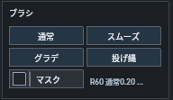
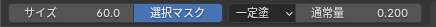
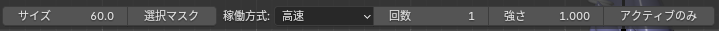
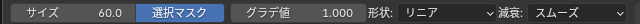
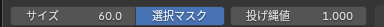

# ブラシ

  

GPU オーバーレイから、ビューポート上で使う独自のウェイトブラシを開始できます。編集モード / ウェイトペイントモードの両方で使え、ブラシ中でも骨取得や骨トランスフォームを併用できます。

- `F` でサイズ変更、`Tab` / `Q` / `Esc` で元のツールへ戻る。
- ツールヘッダーで、サイズ・選択マスク・各ブラシ値などを調整。
- HUD の `サイズ` 欄 : 左右ドラッグで変更、`Shift + ドラッグ` で微調整、クリックで直接入力。範囲は `1〜1000 px` で、`F` とツールヘッダーのサイズに連動します。
- 編集モードは複数メッシュ、ウェイトペイントモードはアクティブメッシュが対象です。
- 4 種類とも編集設定の正規化・小数点・閾値・影響数に対応します。

### 通常ブラシ

  

選択列のウェイトを加算 / 減算する基本ブラシです。

- 左ドラッグで加算、`Ctrl + 左ドラッグ` で減算。
- `Shift + 左ドラッグ` で一時的にスムーズ、`Ctrl + Shift + 左ドラッグ` で周辺の影響を広げる。
- `通常量` : 1 ストロークあたりの変化量。
- `一定塗` : 同じ頂点に重ねても塗りすぎないように塗る。
- `重ね塗` : 当たるたびに `通常量` を加減算し、なぞるほど強くなる。
- ツール設定の `貫通` : 手前の面に加え、奥に重なった面も塗ります。

### スムーズブラシ

  

ウェイトを周囲になじませるブラシです。通常は編集可能なグループをまとめて処理し、塗り跡やミラー後の境界を整えます。

- 左ドラッグでなめらかにする。
- `Shift + 左ドラッグ` : 指先でなぞるようにウェイトを移動。
- `Ctrl + 左ドラッグ` : 選択列の強いウェイトを周囲へ広げる。
- `Alt + 左ドラッグ` : 周囲の弱い値になじませ、選択列の影響を縮小。
- `アクティブグループのみ` : 選択列だけをスムーズにし、周囲に同じ列のウェイトがあれば、0 の頂点にも広げます。
- `強さ` で寄せ具合、`回数` で反復回数を調整。
- 無視列を選択している場合は、その無視列だけを処理。

`稼働方式` で挙動を切り替えます。

- `高速` : カーソル下の接続辺の周辺だけを処理（最も軽い）。
- `表面` : 接続トポロジーをたどってスムーズ（裏面へ貫通しない）。
- `ボリューム` : 空間的に近い頂点も参照し、局所密度に合わせてスムーズ（`ボリューム範囲` で届く範囲を調整）。

### グラデーションブラシ

  

ドラッグ方向に沿って、選択列のウェイトにグラデーションを作るブラシです。

- 通常の左ドラッグはグラデーションで置き換えます。
- `グラデ値` で最大値を調整（減衰カーブに沿ってこの値から 0 へ）。
- `Ctrl` で減算方向、`Shift` で加算方向。
- 種類 : `リニア`（直線）/ `放射`（開始点から外側へ）/ `線放射`（線から広がる）。
- `減衰` : `リニア` / `スムーズ` / `球状` / `ルート` / `シャープ`、または `カスタム`（`カスタム指数` `0.1〜8`）。

### 投げ縄ブラシ

  

囲んだ範囲を指定値で塗るブラシです。広い範囲を一気に 0 / 0.5 / 1.0 などへそろえたいときに向いています。

- 左ドラッグで範囲を囲むと、内側へ `投げ縄値` を適用。
- `Ctrl` で減算方向、`Shift` で加算方向。
- ブラシサイズは、境界をなじませる幅として使われます。

### 選択マスク

  

`マスク` を ON にすると、ブラシの影響先を選択中の頂点だけに制限します。近い別パーツや裏側の頂点へ意図せず塗るのを防げます。すべてのブラシで共通して使えます。頂点が未選択の場合は塗れません。
