# グリッド操作

## 値プリセット / 入力 / 適用

### プリセットボタン

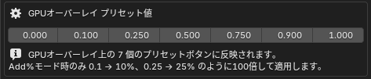

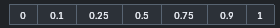

  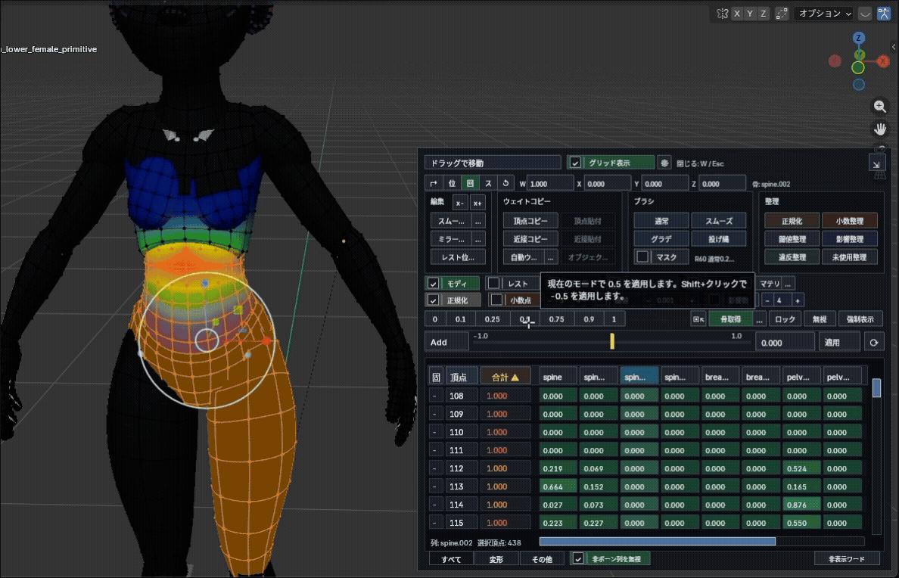

`0` `0.1` `0.25` `0.5` `0.75` `0.9` `1` をワンクリックで適用できます。`Add` / `Add%` モードでは `Shift + クリック` で負方向に適用します。プリセット値はアドオンプリファレンスで変更できます。

### 入力モード / スライダーと数値欄

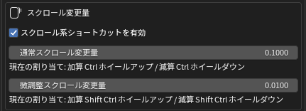

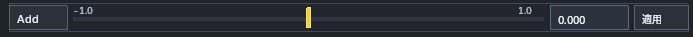

  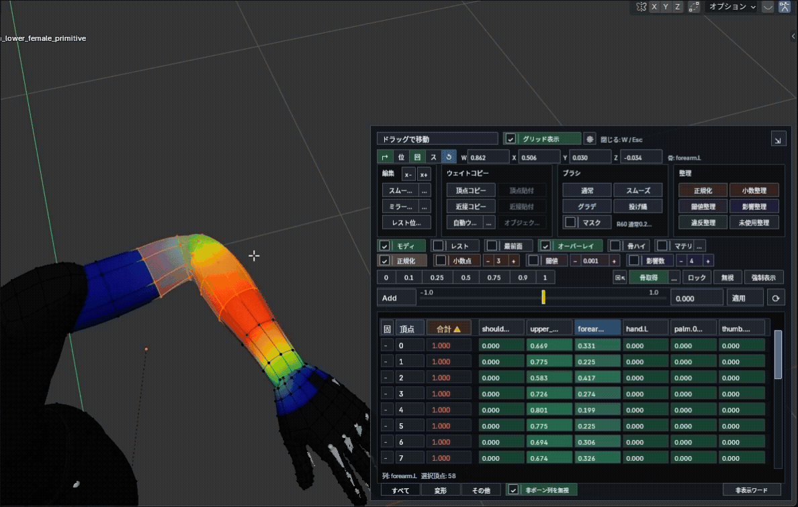

左端のボタンで入力モードを `ABS` → `ADD` → `ADD%` の順に切り替えます。

- `Abs` : 入力値で置き換え。
- `Add` : 現在値に加算（負の値で減算）。
- `Add%` : 現在値に対して割合で加算。

操作方法。

- スライダーのドラッグでリアルタイムに適用（**1 万頂点以上**では、離して確定した時点で適用）。
- 数値欄はクリックで直接入力、上でホイールすると少しずつ変更。
- `適用` : 数値欄の値を選択頂点の現在列に適用。
- `⟳` : 現在の選択頂点でグリッドを手動更新（特殊な選択コマンドの後などに）。
- `Ctrl + ホイール` でウェイトを加減算、`Ctrl + Shift + ホイール` で微調整。セル選択があればそのセルを優先し、なければ現在列が対象です（増減量はプリファレンスで変更可）。

---

## 特殊グループ選択 / 骨取得

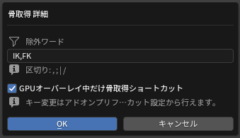

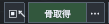

  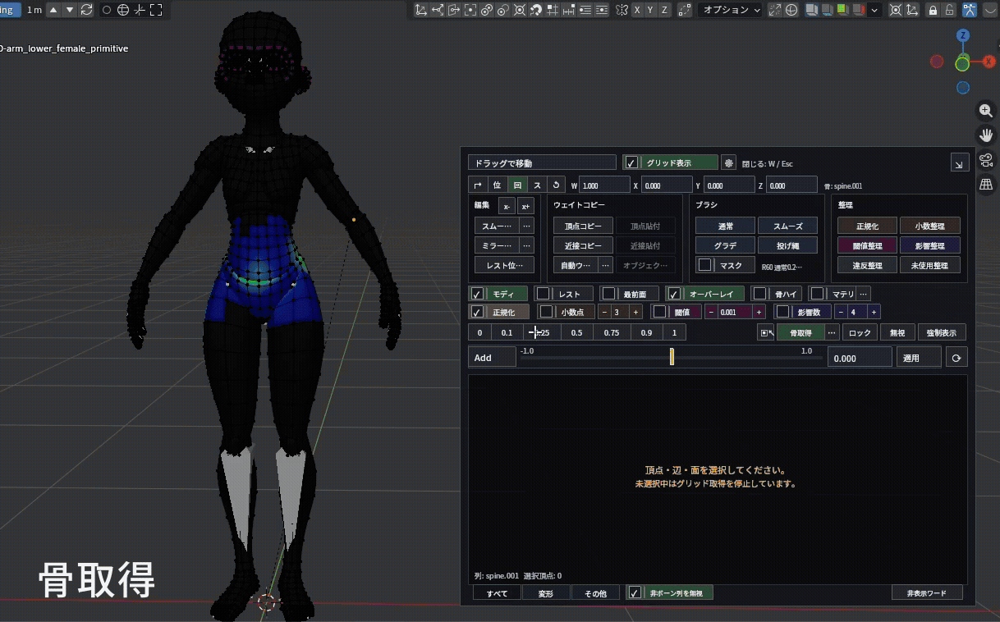

`骨取得` を使うと、ビューポート上のボーンをクリックして、そのボーン名の頂点グループ列を選択できます。複数の Armature モディファイアがある場合は最も近い候補を取得します。

- 表示中は、デフォルトで `Alt + 右クリック` からも骨取得できます（`骨取得` ボタンの `Shift + クリック` で ON / OFF）。
- 右隣の `…` : 除外ワード（`IK` `FK` `twist` などを候補から外す）とショートカットを設定。
- `▣↖` が ON のとき : 選択頂点が変わるたびに、最もウェイト値が高い列を自動選択。頂点を切り替えながら主影響ボーンを確認する作業に向きます。

---

## 列状態 / 表示条件（ロック / 無視 / 強制表示）

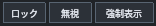
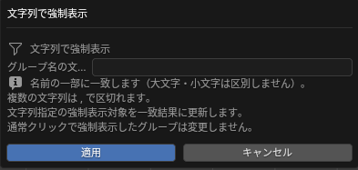

  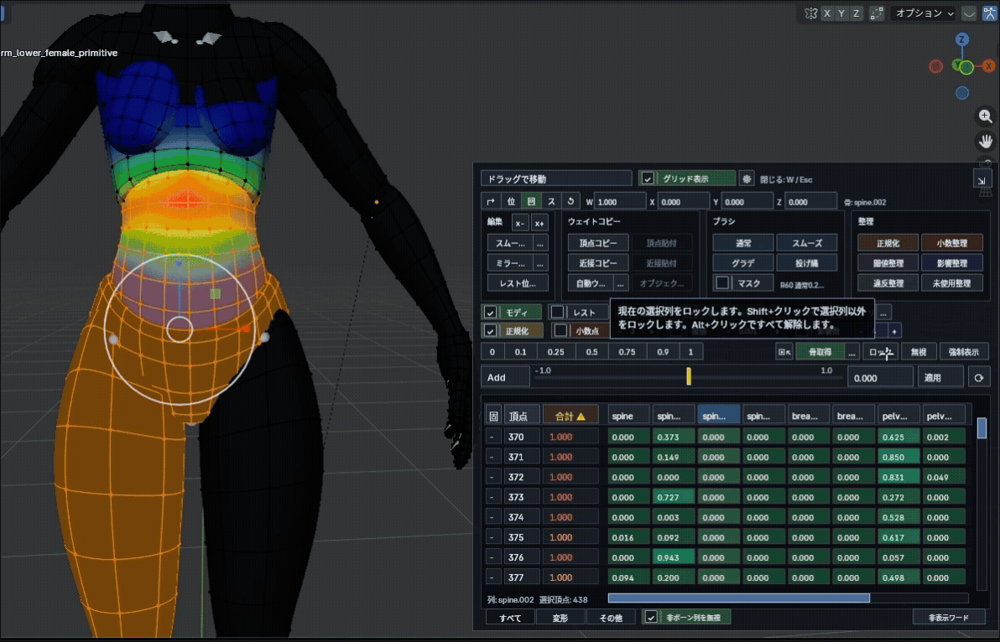

- `ロック` : 選択列を編集できない状態にする。
- `無視` : 対象列を合計・正規化・整理の対象外にする。
- `強制表示` : 0 ウェイトの列でもグリッドに表示する。
- `Shift + クリック` で選択列以外を対象に作用、`Alt + クリック` で状態をすべて解除。
- `Ctrl + 強制表示` : 文字フィルターを開き、カンマ区切りの複数ワードに部分一致する列をまとめて強制表示。

---

## グリッド操作 / 下部タブ

### 列ヘッダー

  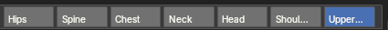

  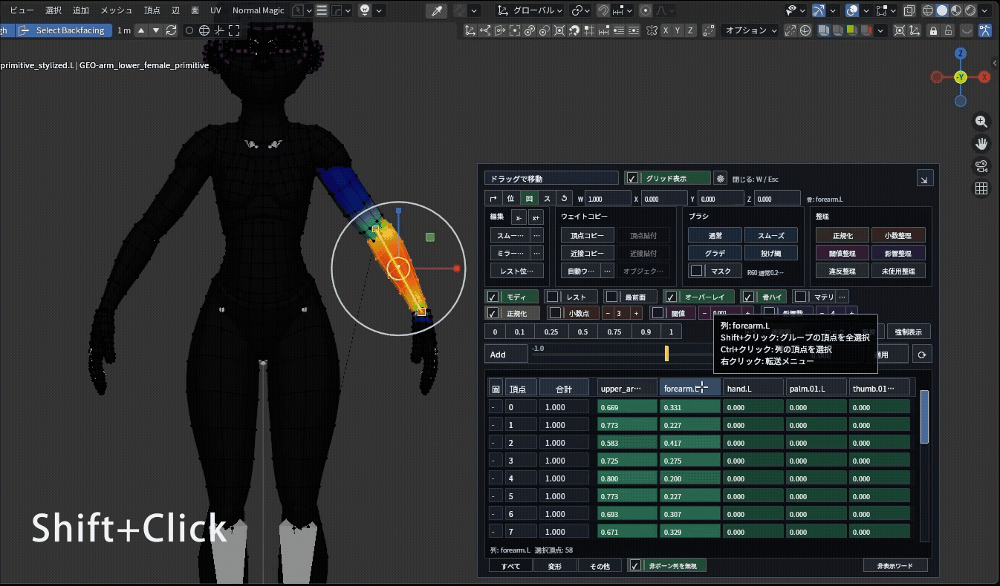

  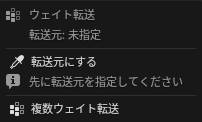

- クリック : その列が選択列になる。
- `Shift + 列クリック` : その頂点グループに値がある頂点をまとめて選択。
- `Ctrl + 列クリック` : 選択中の頂点のうち、その列に値がある頂点だけを残す。
- `Ctrl + Shift + 列クリック` : その列の全セルを、現在のセル選択に追加（全ページの表示行が対象）。
- 右クリック : **ウェイト転送メニュー**を開く。

### L / 頂点 / 合計

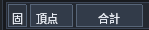

  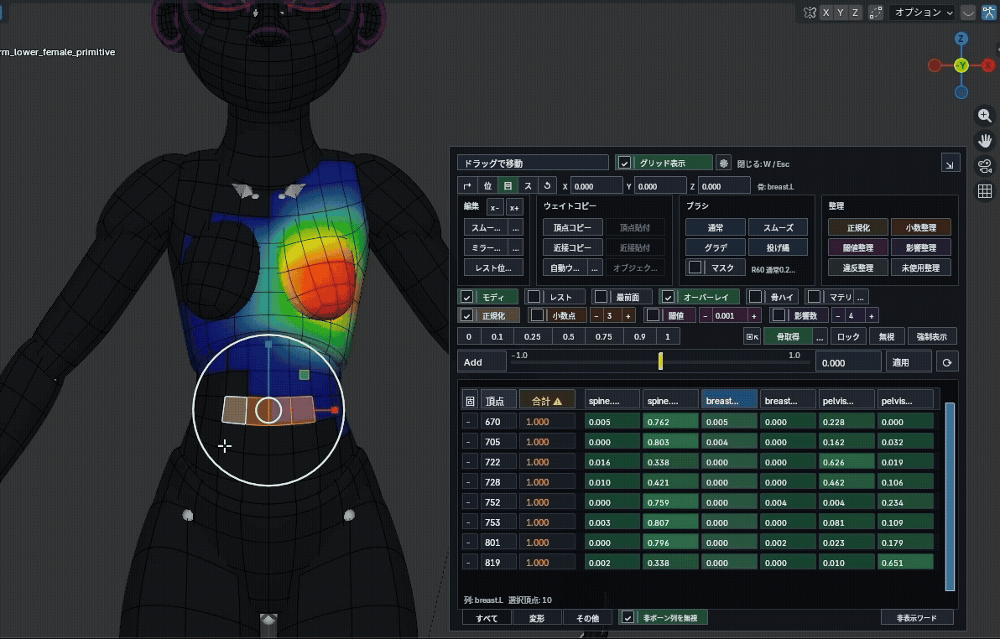

- `L` : 対象頂点をウェイトロック（`Alt + クリック` で解除）。各行の `L` セルでも切り替えられ、ドラッグでまとめて変更できます。
- `頂点` : 表示行をまとめてグリッド選択（`Alt + クリック` で解除）。各行の頂点番号はクリックで選択を切り替え、ドラッグで範囲選択、`Shift + クリック` で追加、`Ctrl + ドラッグ` で解除します。
- `合計` : **違反のみ表示**を切り替え（`Shift + クリック` で表示中の頂点をメッシュ選択）。
- 影響数や合計値に問題がある頂点があると、`合計` ヘッダーが `合計 ⚠` に変わります。
- 違反のみ表示は全ページの違反行が対象です。この表示中の `L` / `頂点` ヘッダー操作も、ページ外の違反行を含みます。`合計` の `Shift + クリック` は現在の表示対象全体をメッシュ選択します。
- 合計セルの警告色は、合計・影響数・小数点・閾値の理由を示します。マウスを重ねると詳細を確認できます。

### セル

  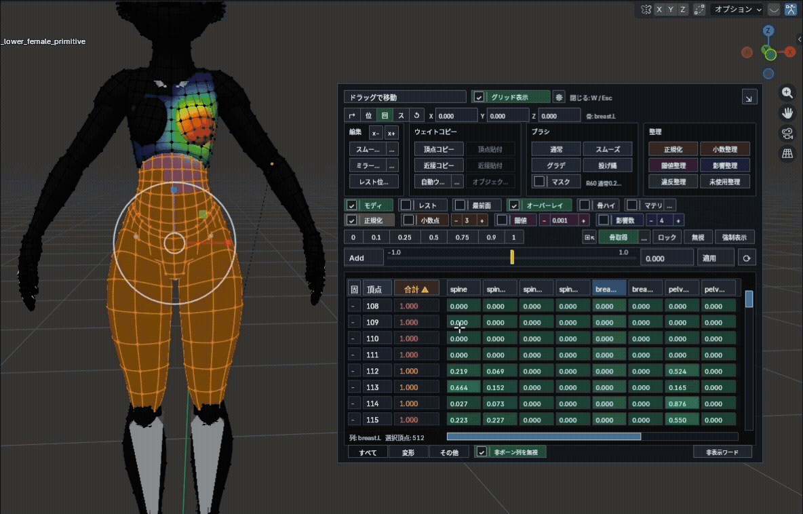

- クリック : 数値を直接入力（`Enter` で確定）。先頭に `+` `-` `*` `/` で現在値へ演算（例: `*0.5`、`+0.1`）。
- ドラッグ : 範囲選択（`Shift + ドラッグ` で追加、`Ctrl + ドラッグ` で解除）。
- 右クリック、またはグリッドの空白をクリック : セル選択を解除。
- `Ctrl + Shift + クリック` : そのセルの列全体を現在のセル選択に追加。全ページの表示行が対象で、列ヘッダーからも同じ操作ができます。
- 複数セル選択中は、入力値をまとめて適用。選択セルが残っている間は、スライダー / ホイール / プリセット / 適用など全ての値変更で実メッシュ選択より優先されます。

### 表示タブ

  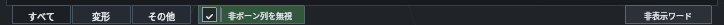

  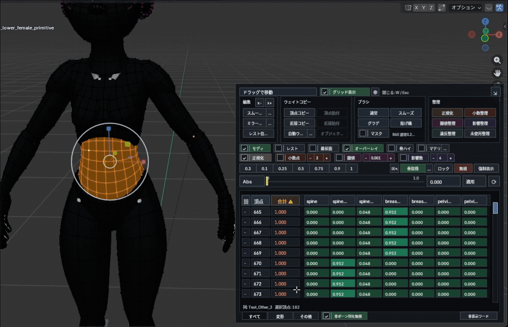

グリッド下部のタブで、表示する列の種類を切り替えます。

- `すべて` : ボーン列と非ボーン列を表示。
- `変形` : ボーン名と一致する変形用の列だけを表示。
- `その他` : ボーン名と一致しない非ボーン列だけを表示。

スクロールバーで縦横に移動できます。グリッド上のホイールは縦、`Shift + ホイール` は横スクロールです。フッターに現在列と選択頂点数を表示します。

タブごとのオプション。

- `非ボーン列を無視`（すべてタブ）: 非ボーン列を合計・正規化・整理から除外します。手動の無視設定は対象を切り替えても保持されます。
- `階層`（すべてタブ、初期設定 ON）: オブジェクトの親をたどり、親階層にあるアーマチュアの骨もボーン列の判定に含めます。OFF では Armature モディファイアだけで判定します。
- `作成済み常時`（その他タブ）: 値が入っていなくても、作成済みの非ボーン列を常に表示。
- `不正規許可`（その他タブ）: ON のとき、その他列は合計が 1 以上でも違反にせず、正規化もしない。
- `非表示ワード` : 列名から指定文字だけを省略します。列そのものは隠さず、実際の頂点グループ名も変えません。

複数編集では、いずれかのメッシュの対象アーマチュアに同名の骨があれば、その名前をボーン列として扱います。`その他` タブの無視設定は独立しています。

### 列右クリックのウェイト転送

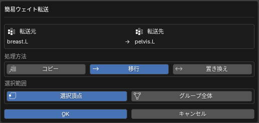

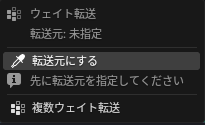

  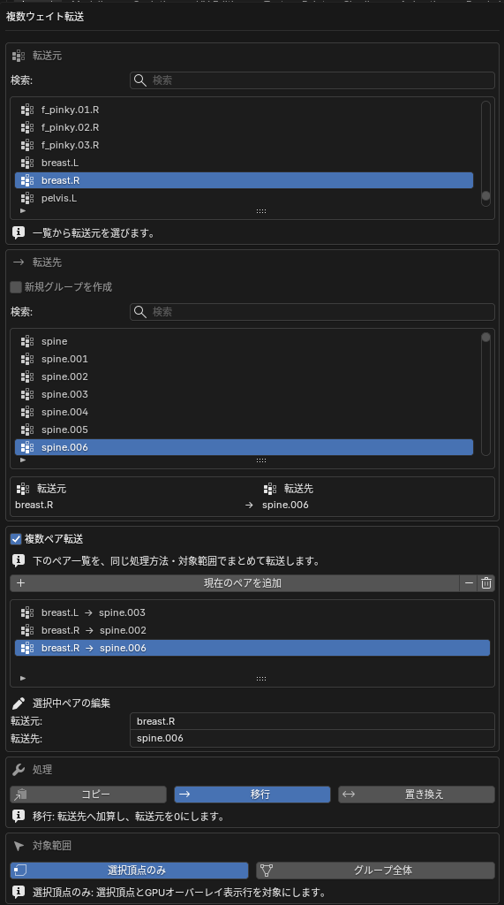

列ヘッダーを右クリックすると、頂点グループ間の転送メニューを開けます。

- `転送元に指定` / `この列へ転送` : 右クリックした列を転送元にし、現在の列へ転送。
- `複数ウェイト転送` : 転送元・転送先・処理方法（`コピー` / `移行` / `置換`）・対象範囲（グループ全体 / 選択頂点）を指定して転送。複数ペアをまとめて処理できます。

---

## 複数オブジェクト編集

複数のメッシュを同時に編集モードにしていると、グリッドのフッターに現在列・選択頂点数・`複数編集: N obj` が表示され、複数オブジェクトの頂点をまとめて扱えます。

また `プロパティ > オブジェクトデータ > 頂点グループ` パネルに `選択を同期` ボタンが追加され、ON にするとオブジェクト間で頂点グループの選択を同期します。
